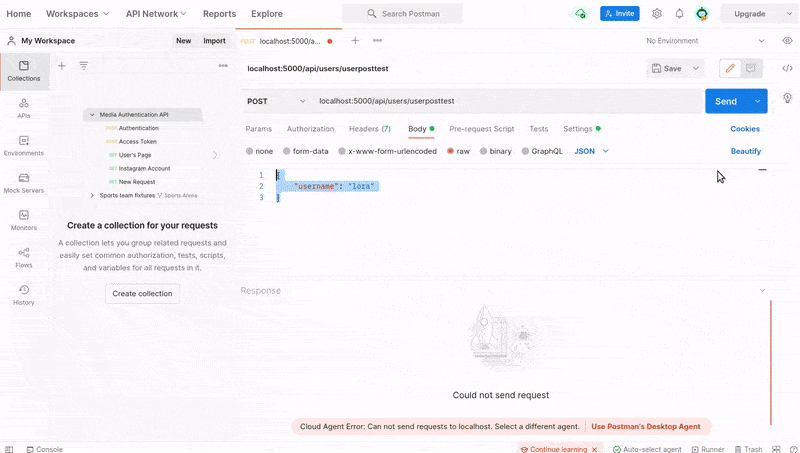
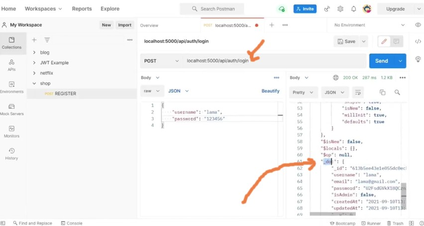

  <!-- 
 styles badge, at the end i decided to cusrom them like in the ecommercejs project
 where i had to create a styles.js file and add the styles there then export it as hook
 https://stackoverflow.com/questions/55766980/custom-color-to-badge-component-not-working
 
  <br>


Photographs for projects


FOOD and objects ----------

https://unsplash.com/@imdauphong

general
https://unsplash.com/collections/75589301/bon-apetite

https://unsplash.com/@ikredenets
https://unsplash.com/photos/Jm_SqbqZYkY
https://unsplash.com/photos/DHaZQh7hR2U

https://unsplash.com/photos/xLS_W6RVx-8

https://unsplash.com/@wendish

https://unsplash.com/@stilclassics

https://unsplash.com/@charlesdeluvio

Christmas
https://unsplash.com/@samhoajti


PLACES ---------

https://unsplash.com/@spoelee4


PEOPLE ---------

https://unsplash.com/photos/BVJ5e-Z2zEk
https://unsplash.com/photos/n3GxXpVcTpI

beautiful black women
https://unsplash.com/@raphaellovaski
https://unsplash.com/photos/88IOcZz53eg
https://unsplash.com/photos/Tfbw4CFFPaY

https://unsplash.com/photos/DTdkZzXYhKI

https://unsplash.com/@dynamicwang
https://unsplash.com/photos/ISrx6MJ7XXI

---

https://unsplash.com/@kirsimakov

---

https://unsplash.com/@ronmcclenny

---

https://unsplash.com/photos/WJ85c_l6JSE

---

https://unsplash.com/photos/aU_eOcelLhQ


# 🐝

# Let's Begin!

## 1. Install the dependencies

```javascript
// copy and paste the following
npm install @material-ui/core @material-ui/icons   react-router-dom node-sass@4.14.1 styled-components

// npm i styled-components
```

 <br>


### Lets start by creating the pages folder

- create the pages folder
- inside of it, create the Home.jsx

<br>

> Here you can see how the [**emmet extension**](https://code.visualstudio.com/docs/editor/emmet) auto complete and automatically create the import on top of the file

 
<br>

 
 
  []()
  


  
  https://code.visualstudio.com/docs/editor/workspace-trust
  
  -->

# 🍯

<!-- phase 2 after, default 1 -->

# JSON Web Token (JWT)

<br>
<br>

### Now that we have the Register and Log, lets add the token

<br>

## What is a JSON Web Token?

> JSON Web Token (JWT) is an open standard (RFC 7519) that defines a compact and self-contained way for securely transmitting information between parties as a JSON object. This information can be verified and trusted because it is digitally signed.

###### [What are the main differences between JWT and OAuth authentication](https://stackoverflow.com/questions/39909419/what-are-the-main-differences-between-jwt-and-oauth-authentication)

<br>

- **JWT (JSON Web Tokens)**- It is just a token format. JWT tokens are JSON encoded data structures contains information about issuer, subject (claims), expiration time etc. It is signed for tamper proof and authenticity and it can be encrypted to protect the token information using symmetric or asymmetric approach. JWT is simpler than SAML 1.1/2.0 and supported by all devices and it is more powerful than SWT(Simple Web Token).

<br>

- **OAuth2 - OAuth2** solve a problem that user wants to access the data using client software like browse based web apps, native mobile apps or desktop apps. OAuth2 is just for authorization, client software can be authorized to access the resources on-behalf of end user using access token.

<br>

- **OpenID Connect** - OpenID Connect builds on top of OAuth2 and add authentication. OpenID Connect add some constraint to OAuth2 like UserInfo Endpoint, ID Token, discovery and dynamic registration of OpenID Connect providers and session management. JWT is the mandatory format for the token.

<br>

# ⚠️

- **CSRF (Cross-Site Request Forgery) protection** - You don't need implement the CSRF protection if you do not store token in the browser's cookie.

> Cross-Site Request Forgery **(CSRF)** is an attack that forces authenticated users to submit a request to a Web application against which they are currently authenticated. CSRF attacks exploit the trust a Web application has in an authenticated user. (Conversely, cross-site scripting (XSS) attacks exploit the trust a user has in a particular Web application). **A CSRF attack exploits a vulnerability in a Web application if it cannot differentiate between a request generated by an individual user and a request generated by a user without their consent.**

#### READ MORE: [Cross-Site Request Forgery](https://www.synopsys.com/glossary/what-is-csrf.html)

<br>
<hr>
<br>

> **Do you ignore your spam emails?** To be honest, they could be more dangerous than you think. Be cautious when visiting a website flooded with advertisements and clickbait. **An attacker behind the screen may trick you into doing something malicious, such as deleting your account on a website, transferring funds illegitimately, and so on**. These are all possible outcomes of a CSRF attack.

#### [React CSRF Protection Guide: Examples and How to Enable It](https://www.stackhawk.com/blog/react-csrf-protection-guide-examples-and-how-to-enable-it/)

<br>
<hr>
<br>

### 🔴

## How does Cross-Site Request Forgery work?

To give you an example, let’s say that Bob has an online banking account on samplebank.com. He regularly visits this site to conduct transactions with his friend Alice. Bob is unaware that samplebank.com is vulnerable to CSRF attacks. Meanwhile, an attacker aims to transfer $5,000 from Bob’s account by exploiting this vulnerability. To successfully launch this attack:

- The attacker must build an exploit URL.
- The attacker must also trick Bob into clicking the exploit URL.
- Bob needs to have an active session with samplebank.com.

#### Let’s say that the online banking application is built using the GET method to submit a transfer request.

As such, Bob’s request to transfer $500 to Alice (with account number 213367) might look like this:

```javascript

GET https://samplebank.com/onlinebanking/transfer?amount=500&accountNumber=213367 HTTP/1.1

```

Aligning with the first requirement to successfully launch a CSRF attack, an attacker must craft a malicious URL to transfer $5,000 to the account 425654:

```javascript
https://samplebank.com/onlinebanking/transfer?amount=5000&accountNumber=425654

```

Using various social engineering attack methods, an attacker can trick Bob into loading the malicious URL. **This can be achieved in various ways**. For instance, including malicious HTML image elements onto forms, placing a malicious URL on pages that are often accessed by users while logged into the application, or by sending a malicious URL through email.

#### The following is an example of a disguised URL:

```javascript


```

# 🔴

#### Consider the scenario that includes an image tag in an attacker-crafted email to Bob.

> Upon receiving it, **Bob’s browser application opens this URL automatically—without human intervention**. As a result, without Bob’s permission, a malicious request is sent to the online banking application. If Bob has an active session with samplebank.com, the application would treat this as an authorized amount transfer request coming from Bob. It would then transfer the amount to the account specified by an attacker.

#### READ MORE: [Cross-Site Request Forgery](https://www.synopsys.com/glossary/what-is-csrf.html)

<br>

# 🌈

## How can an application prevent a Cross-Site Request Forgery attack?

- **To defeat a CSRF attack**, applications need a way to determine if the HTTP request is legitimately generated via the application’s user interface. The best way to achieve this is through a CSRF token. A CSRF token is a secure random token (e.g., synchronizer token or challenge token) that is used to prevent CSRF attacks. **The token needs to be unique per user session and should be of large random value to make it difficult to guess**.

<br>

- **A CSRF secure application assigns a unique CSRF token for every user session**. These tokens are inserted within hidden parameters of HTML forms related to critical server-side operations. They are then sent to client browsers.

<br>
<hr>
<br>

## How to prevent it in our React Application

#### [React CSRF Protection Guide: Examples and How to Enable It](https://www.stackhawk.com/blog/react-csrf-protection-guide-examples-and-how-to-enable-it/)

<br>
<hr>
<br>

# Let's Continue!!

```javascript
// auth.js
//
//He we are destructuring the password + other information
// we do that in a way to diversify the password that we see
// inside the mongoDB
const { password, ...others } = user;
//
//
```

#### AT this point I will get an error

```javascript

SyntaxError: Identifier 'password' has already been declared

[nodemon] app crashed - waiting for file changes before starting...
```

### So lets change the password variable we have above the line of code we just created, it should look like this now:

```javascript
// change password here for Originalpassword
const Originalpassword = hashedPassword.toString(CryptoJS.enc.Utf8);
// change password here for Originalpassword
Originalpassword !== req.body.password &&
  res.status(401).json("wrong password");
//
//
const { password, ...others } = user;
```

<br>
<br>

#### So this is what we have:

```javascript
const router = require("express").Router();
const User = require("../models/User");
const CryptoJS = require("crypto-js");

//REGISTER
//post, because the user is going to send username, password and other information
router.post("/register", async (req, res) => {
  const newUser = new User({
    username: req.body.username,
    email: req.body.email,
    password: CryptoJS.AES.encrypt(
      req.body.password,
      process.env.PASS_SECRETO
    ).toString(),
  });
  //

  // error handling
  try {
    const savedUser = await newUser.save();
    //console.log(savedUser);
    res.status(200).json(savedUser);
    //200 is successfully
    // 201 is successfully add
  } catch (err) {
    // console.log(err);
    res.status(500).json(err);
  }
  //
});
//
//
//
//
//  LOGIN  *-----------------------*

router.post("/login", async (req, res) => {
  try {
    const user = await User.findOne({
      username: req.body.username,
    });

    //
    !user && res.status(401).json("wrong username");
    //

    //

    const hashedPassword = CryptoJS.AES.decrypt(
      user.password,
      process.env.PASS_SECRETO
    );
    //
    //
    //
    const OriginalPassword = hashedPassword.toString(CryptoJS.enc.Utf8);

    //1 if the password isnt equal to the request the user is sending
    // then, show a 401 error
    OriginalPassword !== req.body.password &&
      res.status(401).json("wrong password");
    //
    //He we are destructuring the password + other information
    // we do that in a way to diversify the password that we see
    // inside the mongoDB
    const { password, ...others } = user;
    //
    //2 if its good, show success
    res.status(200).json(user);

    //
  } catch (err) {
    res.status(500).json(err);
  }
});

//

module.exports = router;
```

<br>
<br>

### After changing the variable, everything is fine again but...

- In Postman we will get another issue(in my case it didn't happen, but i will document it anyway)

- his outcome

[]()
