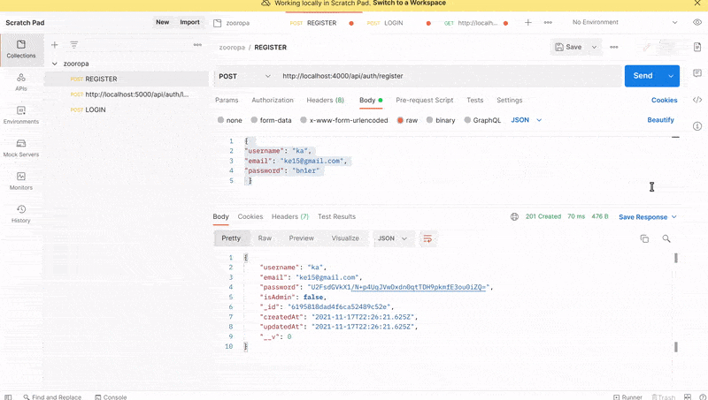

 <!-- 
 styles badge, at the end i decided to custom them like in the commercejs project
 where i had to create a styles.js file and add the styles there then export it as hook
 https://stackoverflow.com/questions/55766980/custom-color-to-badge-component-not-working
 
  <br>


Photographs for projects


FOOD and objects ----------

https://unsplash.com/@imdauphong

general
https://unsplash.com/collections/75589301/bon-apetite

https://unsplash.com/@ikredenets
https://unsplash.com/photos/Jm_SqbqZYkY
https://unsplash.com/photos/DHaZQh7hR2U

https://unsplash.com/photos/xLS_W6RVx-8

https://unsplash.com/@wendish

https://unsplash.com/@stilclassics

https://unsplash.com/@charlesdeluvio

Christmas
https://unsplash.com/@samhoajti


PLACES ---------

https://unsplash.com/@spoelee4


PEOPLE ---------

https://unsplash.com/photos/BVJ5e-Z2zEk
https://unsplash.com/photos/n3GxXpVcTpI

beautiful black women
https://unsplash.com/@raphaellovaski
https://unsplash.com/photos/88IOcZz53eg
https://unsplash.com/photos/Tfbw4CFFPaY

https://unsplash.com/photos/DTdkZzXYhKI

https://unsplash.com/@dynamicwang
https://unsplash.com/photos/ISrx6MJ7XXI

---

https://unsplash.com/@kirsimakov

---

https://unsplash.com/@ronmcclenny

---

https://unsplash.com/photos/WJ85c_l6JSE

---

https://unsplash.com/photos/aU_eOcelLhQ


# 🐝

# Let's Begin!

## 1. Install the dependencies

```javascript
// copy and paste the following
npm install @material-ui/core @material-ui/icons   react-router-dom node-sass@4.14.1 styled-components

// npm i styled-components
```

 <br>


### Lets start by creating the pages folder

- create the pages folder
- inside of it, create the Home.jsx

<br>

> Here you can see how the [**emmet extension**](https://code.visualstudio.com/docs/editor/emmet) auto complete and automatically create the import on top of the file

 
<br>

 
 
  []()
  


  
  https://code.visualstudio.com/docs/editor/workspace-trust
  

  Un "Bearer Token" est un JSON Web Token dont le rôle est d'indiquer que l'utilisateur qui accède aux ressources est bien authentifié. ... Cet attribut permet d'indiquer que l'accès à ce controller (et donc les méthodes qui le composent) ne peut se faire que si l'utilisateur est authentifié.
------------------------


What is req body in Express?


The req. body object allows you to access data in a string or JSON object from the client side. You generally use the req. body object to receive data through POST and PUT requests in the Express server. ... body object into the console results in the user's email and password.

  -->

# 🐻

<!-- phase 2 after, default 1 -->

# 1. ADMIN function

## 2. DELETE router

<br>
<hr>
<br>

# ADMIN ✋

<br>

- Since only admin can add any products, we have to create a function that allows **the admin only** to create products.

- Go to the verifyToken.js to add the following function.

```javascript
//verifyToken.js
// -------------------------------------------
//                  3
//              VERIFY ADMIN
//    Only the admin can create products
//
// -------------------------------------------
//
const verifyTokenAndAdmin = (req, res, next) => {
  verifyToken(req, res, () => {
    //1 if the user is admin
    if (req.user.isAdmin) {
      // 2 we are going to continue the function
      next();
    } else {
      res.status(403).json("Only Admin is allowed add a product");
    }
  });
};

module.exports = {
  verifyToken,
  verifyTokenAndAuthorization,
  verifyTokenAndAdmin,
};
```

<br>
<hr>
<br>

# DELETE ✋

<br>

### Now create the Delete router

<br>

#### Go to the user.js and create the 'delete router'

```javascript
// user.js
//---------------------------------
//            DELETE
//---------------------------------
//
//
//
router.delete("/:id", verifyTokenAndAuthorization, async (req, res) => {
  //
  // Here we will find and delete
  //  that specific User/ and all the
  // schema data that this User contains
  try {
    await User.findByIdAndDelete(req.params.id);
    res.status(200).json("User has been deleted");
  } catch (err) {
    res.status(500).json(err);
  }
});

module.exports = router;
```

<br>
<hr>
<br>

# GET 🖐️

### Now create the GET router

- but before lets go back to the **auth.js** and COPY the following line 'as its showing all the information of the user', and we dont want that for what we are going to do, so to **prevent that, we will have to destructure it**

<br>

- Go to the **user.js** and **paste this 2 lines** there, then change few things.

<br>

```javascript
// copy this from the auth.js
//
//  REPLACE THIS:
//2 lines
const { password, ...others } = user._doc;
res.status(200).json({ ...others, accessToken });
//
//
//
//      and PASTE it inside the user.js
const { password, ...others } = user._doc;
//._doc; will grab the user data from the object in mongoDb
//
res.status(200).json({ others });
```

<br>
<br>

## Now write another end point to get the user id

```javascript
//
// before
router.get("/:id",
//
// after
router.get("/find/:id",
```

<br>
<br>

### Now lets test it

- Go to postman and type the following inside the url

- log in (with your last user)
- grab the token
- grab the user id
- change the method from PUT to GET

[]()

<br>

## This is what we have far:

##### user.js

```javascript
// user.js
//
//
//---------------------------------
//           GET user
//  only the Admin get the user
//---------------------------------
//
router.get("/find/:id", verifyTokenAndAdmin, async (req, res) => {
  //

  try {
    // Find it throught the Id
    const user = await User.findById(req.params.id);

    const { password, ...others } = user._doc;
    //._doc; will grab the user data from the object in mongoDb
    //
    res.status(200).json({ others });
  } catch (err) {
    res.status(500).json(err);
  }
});
//
//
module.exports = router;
```

##### verifyToken.js

```javascript
//
//
// -------------------------------------------
//                  3
//              VERIFY ADMIN
//    Only the admin can create products
//
// -------------------------------------------
//
const verifyTokenAndAdmin = (req, res, next) => {
  verifyToken(req, res, () => {
    //1 if the user is admin
    if (req.user.isAdmin) {
      // 2 we are going to continue the function
      next();
    } else {
      res.status(403).json("You are not allowed to do that");
    }
  });
};

module.exports = {
  verifyToken,
  verifyTokenAndAuthorization,
  verifyTokenAndAdmin,
};
```
