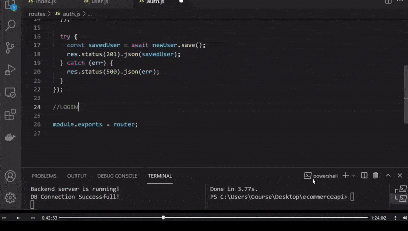

  <!-- 
 styles badge, at the end i decided to cusrom them like in the ecommercejs project
 where i had to create a styles.js file and add the styles there then export it as hook
 https://stackoverflow.com/questions/55766980/custom-color-to-badge-component-not-working
 
  <br>


Photographs for projects


FOOD and objects ----------

https://unsplash.com/@imdauphong

general
https://unsplash.com/collections/75589301/bon-apetite

https://unsplash.com/@ikredenets
https://unsplash.com/photos/Jm_SqbqZYkY
https://unsplash.com/photos/DHaZQh7hR2U

https://unsplash.com/photos/xLS_W6RVx-8

https://unsplash.com/@wendish

https://unsplash.com/@stilclassics

https://unsplash.com/@charlesdeluvio

Christmas
https://unsplash.com/@samhoajti


PLACES ---------

https://unsplash.com/@spoelee4


PEOPLE ---------

https://unsplash.com/photos/BVJ5e-Z2zEk
https://unsplash.com/photos/n3GxXpVcTpI

beautiful black women
https://unsplash.com/@raphaellovaski
https://unsplash.com/photos/88IOcZz53eg
https://unsplash.com/photos/Tfbw4CFFPaY

https://unsplash.com/photos/DTdkZzXYhKI

https://unsplash.com/@dynamicwang
https://unsplash.com/photos/ISrx6MJ7XXI

---

https://unsplash.com/@kirsimakov

---

https://unsplash.com/@ronmcclenny

---

https://unsplash.com/photos/WJ85c_l6JSE

---

https://unsplash.com/photos/aU_eOcelLhQ


# 🐝

# Let's Begin!

## 1. Install the dependencies

```javascript
// copy and paste the following
npm install @material-ui/core @material-ui/icons   react-router-dom node-sass@4.14.1 styled-components

// npm i styled-components
```

 <br>


### Lets start by creating the pages folder

- create the pages folder
- inside of it, create the Home.jsx

<br>

> Here you can see how the [**emmet extension**](https://code.visualstudio.com/docs/editor/emmet) auto complete and automatically create the import on top of the file

 
<br>

 
 
  []()
  


  
  https://code.visualstudio.com/docs/editor/workspace-trust
  
  -->

# 🍯

<!-- phase 2 after, default 1 -->

# ROUTES / FOR THE SCHEMAS

<br>
<br>

### Now that we have the SCHEMAS, lets delete the test routes we have inside the user.js

<br>

- Inside the **routes/user.js**

#### DELETE THE FOLLOWING:

<br>

```javascript
//
//   GET
//
router.get("/usertest", (req, res) => {
  res.send("user test rainbow cringe is successful");
});
//
//   POST
//
router.post("/userposttest", (req, res) => {
  //everytime the user is going to add any input, you
  //should pass   'body'
  const username = req.body.username;
  console.log(username);
});
//
```

 <br>
 <br>

### Now COPY what is left and PASTE it to the new routes, these new routes will match the freshly created SCHEMAS

```javascript
const router = require("express").Router();

//
//
module.exports = router;
```

<br>
<br>

# 🍯 🥛

### CREATE THE ROUTES

> Since we already have the **route** for the user.js, we only have to create the following inside the **routes folder**:

<br>

##### <u>all in lowercase</u>

- cart.js
- order.js
- products.js

<br>

### Now paste this inside each one of them:

```javascript
const router = require("express").Router();

//
//
module.exports = router;
```

<br>
<br>
<hr>
<br>
<br>

# 🤺

### Now that we are ready, lets create the first USER

#### 🔴 Authentication inside the 'user route', is not a good practice, thats why I will create another route.

<br>

- this new route will be called **auth.js**

<br>

- INside the auth.js add the following:

```javascript
const router = require("express").Router();
const User = require("../models/User");

//REGISTER
//post, because the user is going to send username, password and other information
router.post("/register", (req, res) => {
  const newUser = User({
    username: req.body.username, //Here we are grabing the data from
    // the schema inside the models/User.js
  });
});
//
//
module.exports = router;
```

<br>

#### Here we are taking the _data_ from the _schema_ inside the models/User.js

```javascript
 username: req.body.username, //Here we are grabing the data from
  // the schema inside the models/User.js
```

<br>
<br>

### Recapitulating

- this data is requesting information to data in block b

#### block a

```javascript
const router = require("express").Router();
const User = require("../models/User");

//REGISTER
//post, because the user is going to send username, password and other information
router.post("/register", (req, res) => {
  const newUser = User({
    username: req.body.username,
    email: req.body.email,
    password: req.body.password,
  });
});
//
//
module.exports = router;
```

#### block b

```javascript
const mongoose = require("mongoose");

const UserSchema = new mongoose.Schema(
  {
    userName: {
      type: String,
      required: true,
      unique: true, //unique:we cannot create another username with the same username
      lowercase: true,
    },
    email: { type: String, required: true, unique: true },
    password: { type: String, required: true },
    isAdmin: {
      type: Boolean, //because its going to be: TRUE or FALSE
      default: false, // since its false, this user is NOT going to be an Admin
    },
  },
  { timestamps: true }
);

module.exports = mongoose.model("User", UserSchema);
```

 <br>
 <br>
 <br>

## Now lets save a User everytime we click 'send' inside of postman, just like we did with the test name to see if postman was actually working:

<br>

- Create an object like the one below **(if you notice we are using the schema structure from block a and b, to add data )**:

<br>

#### Dont click send after you create the object, as we still need to do a last thing.

<br>

```javascript
{
  "username": "lora",
  "email": "lora@gmail.com",
  "password": "1234"
}
```

<br>

### OPEN postman

- WE ARE GOING TO SIGN the .body of data but it doesnt mean that we are creating the **user** in our **DB**, its just a model object, we should send this to our DB

<br>

##### SO HOW ARE WE GOING TO DO THIS?

- We are going to use the **save** method

[possible errors | .save() is not a Function Mongoose](https://www.py4u.net/discuss/1472322)

```javascript
newUser.save();
```

<br>

### But if we do it in that way we are going to have issues 🍌

> The reason for that is that **Save()** is a method on a Mongoose document. The save() method is asynchronous, so it returns a promise that you can await on.

<br>

## > So what is Save() doing here?

<br>

- Since **Save()** is an ASYNCHRONOUS function, every time we save a document, UPDATE, DELETE etc in our **DB**, basically it takes a **couple of miliseconds** it depends on the server, mongo db server etc, so there s not chance to know if something will take time or go wrong.

- So lets say if i write the following:

```javascript
const savedUser = newUser.save();
console.log(savedUser);
```

### Its not going to work because:

- What is going to happens is that its going to directly start this process **const savedUser = newUser.** and after that its going to show the **console.log(savedUser)** but at that moment we dont have **console.log(savedUser)** and that is **because it takes a couple of milliseconds**

<br>

#### To prevent this: we are going to create an async function here

<br>

```javascript
const router = require("express").Router();
const User = require("../models/User");

router.post("/register", async (req, res) => {
  const newUser = User({
    username: req.body.username,
    email: req.body.email,
    password: req.body.password,
  });
  //
  const savedUser = await newUser.save();
  console.log(savedUser);

  //
});

//
//
module.exports = router;
```

<br>
### what this line below means is:

```javascript
const savedUser = await newUser.save();
console.log(savedUser);
```

- we are going to wait this process **const savedUser = await newUser.** and after that , **IF WE HAVE savedUser** we are going to **console.log(savedUser);**

## But if there is any error, we are going to add a 'try and catch'

```javascript
const router = require("express").Router();
const User = require("../models/User");

//REGISTER
//post, because the user is going to send username, password and other information
router.post("/register", async (req, res) => {
  // the User with the SCHEMA data
  const newUser = new User({
    username: req.body.username,
    email: req.body.email,
    password: req.body.password,
  });
  //

  //

  // error handling
  try {
    const savedUser = await newUser.save();
    //console.log(savedUser);
    res.status(200).json(savedUser);
    //200 is successfully
    // 201 is successfully add
  } catch (err) {
    // console.log(err);
    res.status(500).json(err);
  }
  //
});

//
//
module.exports = router;
```

<br>

## SINCE the teacher dont want to spend too much time with the errors, here is a better version of error Handling [(its from a previous project)](https://github.com/nadiamariduena/ecommerce2/blob/master/src/docs/USER_AUTH.md)

- read the comments

```javascript
const express = require("express");
const router = express.Router();
const User = require("../models/user");

//
// the ROUTES are the box receiver of the MODELS data schemas
//
//
router.get("/signin", (req, res, next) => {});

router.post("/signup", (req, res, next) => {
  // the User with the SCHEMA data
  User.findOne({
    /*  if inside the req.body which is the 
    data that the user is sending using the structure inside the schema
    , if in that data there's a similar email,
    then send an error.

    */
    email: req.body.email,
  }).exec((error, user) => {
    if (user)
      // if the user sends an existent email, return 400 status
      return res.status(400).json({
        message: "User already registered",
      });
    //
    //
    const { firstName, lastName, email, password } = req.body;
    //Its says YOU KNOW WHAT create a new User:
    // new User(
    //  "based" on
    //the User model schema in (user.js/models) , and pass inside those guys
    // (req.body);
    //so the data the user is giving:
    const _user = new User({
      firstName,
      lastName,
      email,
      password,
      //   to generate a random number to use in username
      username: Math.random().toString(),
    });

    //                      ** SAVING the DATA **
    //
    // to save the data the user sent, you need the following:
    _user.save((error, data) => {
      // IF ERROR
      // if there s any error in the data, return status 400 and "something went wrong"
      if (error) {
        return res.status(400).json({
          message: "Something went wrong",
        });
      }
      // IF SUCCESS , SAVE the data
      if (data) {
        return res.status(201).json({
          user: data,
        });
      }
    });
  });
});

module.exports = router;
```

<br>

# 🐝

## Check all the statuses

> httpstatuses.com is an easy to reference database of HTTP Status Codes with their definitions and helpful code references all in one place. Visit an individual status code via httpstatuses.com/code or browse the list below.

[HTTP Status Codes](https://httpstatuses.com/)

<br>

## Before testing it in Postman, lets handle the routes in the index.js

<br>

```javascript
//---------------------
//   BODY PARSER
//---------------------
// ALWAYS add the BODY PARSER before the routes
//
app.use(express.json());
//
//careful where you position the lines
// they have to match with the organization of the api down
//  below:
// otherwise you will get an error
const authRoute = require("./routes/auth");
const userRoute = require("./routes/user");

//
//
//
//
app.use("/api/auth", authRoute);
//if you are using a REST API this will be plural: instead of user , users
app.use("/api/users", userRoute);
```

<br>

### Now lets finally go to the POSTMAN

- If at this point you have an error, check the solution in the folder of errors []()

[]()

#### As you can see the creation of the de Collection is working

<br>

- Now we have to correct the password, as if you notice at the end of the GIF image, we didnt add any protection for it.

### 🔴

> Since its **dangerous to set passwords in such way**, (as if someone has access to any of my DB, they can reach any password and mess with it) so to prevent that, we will have to implement some **password encryption**

## So lets go back to auth.js and see what we have there

<br>

```javascript
router.post("/register", async (req, res) => {
  const newUser = new User({
    username: req.body.username,
    email: req.body.email,
    password: req.body.password, //here we are grabing the password DIRECTLY
  });
```

<br>

- As you can see here, we are getting the password directly: **password: req.body.password**, lets encrypt that.

<br>

<hr>

### There are many options to Encrypt out there, but in this example we are going to use [CRYPTOJS](https://cryptojs.gitbook.io/docs/)

<br>

# 👮‍♂️

### Ciphers

#### The Cipher Algorithms

### AES

> The Advanced Encryption Standard (AES) is a U.S. Federal Information Processing Standard (FIPS). It was selected after a 5-year process where 15 competing designs were evaluated.

```javascript
var encrypted = CryptoJS.AES.encrypt("Message", "Secret Passphrase");
​
var decrypted = CryptoJS.AES.decrypt(encrypted, "Secret Passphrase");
```

- CryptoJS supports AES-128, AES-192, and AES-256. **It will pick the variant by the size of the key you pass in. If you use a passphrase, then it will generate a 256-bit key**.

<br>

##### DES, Triple DES

- ES is a previously dominant **algorithm for encryption**, and was published as an official Federal Information Processing Standard (FIPS). DES is now considered to be insecure due to the small key size.

<br>

### Here is another option:

## BCRYPT 🍌

#### General Hash Function Background

> In general, a hash algorithm or function takes data (i.e., the password) and maps to "fixed-size values," or creates a "digital fingerprint," or hash, of it. This hash is not exactly the same as the Ruby class, but they are similar. A hashing algorithm is like a key-value pair of passwords and their encryptions, but you wouldn't want to store or save them like that! The process is never truly "reversible," in the sense that if I hashed a list of passwords, and all you had was a list of unique crypts, the only way you could "hack" my passwords would be through something like brute force search. But you could never take a hashed value and return it to its original form!

#### [ecommerce2](https://github.com/nadiamariduena/ecommerce2/blob/master/src/docs/USER_AUTH.md)

<hr>

<br>

### Lets add Cryptojs to the project

- open another terminal inside your project and add this:

```javascript
// https://www.npmjs.com/package/crypto-js
npm i crypto-js
```

#### Now import it:

```javascript
const CryptoJS = require("crypto-js");
```

#### Copy this from the website

```javascript
CryptoJS.AES.encrypt("Message", "Secret Passphrase");
```

#### Add it to our password

```javascript
    password: CryptoJS.AES.encrypt("Message", "Secret Passphrase"),
```

<br>

# 🐖

#### REPLACE the first argument with: <u>req.body.password </u>

```javascript
// BEFORE
    password: req.body.password,


//
// AFTER
    password: CryptoJS.AES.encrypt(req.body.password, "Secret Passphrase")
```

<br>

### For the second argument we have to go to the .env and create a variable.

<br>

- under the MongoDB credential create this new variable:

```javascript
PASS_SECRETO = *My*l0v3ly*pig
```

<br>

#### AFTER that go back to the auth.js and add the new variable there like so:

```javascript
password: CryptoJS.AES.encrypt(req.body.password, process.env.PASS_SECRETO).toString(),
```

<br>

## .toString()

> #### How does String help security?

> For example, **database usernames and passwords are passed as String to get the database connection**, in-socket programming host, and port details passed as String. Since String is immutable(unchangeable ), it's value can't be changed. Otherwise, any hacker could change the referenced value to cause security issues in the application."

### ⚠️ but

> Any one who has access to memory dump can find the password in clear text and that’s another reason to use encrypted password than plain text. So Storing password in character array clearly mitigates security risk of stealing password.

##### read more [Why to use char[] array over a string for storing passwords in Java?](https://www.geeksforgeeks.org/use-char-array-string-storing-passwords-java/)

<br>

## NOW LETS TEST IT

#### Go back to the MOngoDB and delete the users inside the collections but not the collection!

- ONCE its empty, go back to the postman and repeat the same procedure

<br>

#### If you already have a collection do the following:

- check you have the URL: **http://localhost:5000/api/auth/register**

- body
- raw
- JSON

```javascript

{
"username": "carag hol",
"email": "rajopd@gmail.com",
"password": "vvvdorejj"
 }
```

#### then check that you are connected

- while being **succesfully** connected to the **PORT 3000** (inside my index.js)
  <br>

- You can press **SEND**

<br>

> **Like so:**

[]()

### NOW CHECK in MongoDB if the password is HASHED

```javascript
    _id
    :618f2836f43fe8b5c355f4ec
    username
    :"novo hol"
    email
    :"zarakaijopd@gmail.com"
    password
    :"U2FsdGVkX1+HmazASsY3VJoVNg/1PG2+2FUP7zJpE50=" //the hashed password
    isAdmin
    :false
    createdAt
    :2021-11-13T02:51:34.273+00:00
    updatedAt
    :2021-11-13T02:51:34.273+00:00
    __v
    :0
```

<br>
<br>

<hr>

<br>
<br>

# LOGIN

##### check this just to compare [ecommerce](https://github.com/nadiamariduena/ecommerce2/blob/master/src/docs/ADMIN_USER-AUTH.md)

<br>
<br>

### Start by creating the async function

- Then go to postman and delete **all** the collections that are connected to the parent collection, the parent if you remember is the one inside the **.env**

<br>

- At this point you just have the parent collection(dont forget also to delete them in mongo), still in **postman**, click in the collection (left side), then **go to** the button save and **click the arrow** and select **save as**, a window will open, inside of it paste the **http://localhost:5000/api/auth/register** and choose the collection, then save.

<br>

- click again in the collection (left side), replace the **http://localhost:5000/api/auth/register** for just REGISTER.

<br>

- If you notice, we are setting up a request for each, first we had the **REGISTER**, now we will create the **LOGIN** request.

<br>

- Click in the collection and add a new request, paste the **http://localhost:5000/api/auth/register** but instead of register add **\*login**, like so: **http://localhost:5000/api/auth/login**

<br>

#### REPEAT the steps:

**http://localhost:5000/api/auth/login**

- body
- raw
- JSON

##### Here you will have to do it differently

```javascript
// this is for registering
{
"username": "carag hol",
"email": "rajopd@gmail.com",
"password": "vvvdorejj"
 }
//
//
// Now in the login we will need only the username and the password
{
"username": "carag hol",
"password": "vvvdorejj"
 }
```

<br>

[]()

#### Lets create the function to make it work

```javascript
//
//
//  LOGIN

router.post("/login", async (req, res) => {
  try {
    //User: makes reference to the User model inside the models folder

    // The findOne() method returns the first
    // occurrence in the selection.

    const user = await User.findOne({
      username: req.body.username,
    });
  } catch (err) {
    res.status(500).json(err);
  }
});

//

module.exports = router;
```

### What is findOne in Javascript?

> The findOne() method returns the first
> occurrence in the selection. The first
> parameter of the findOne() method is a
> query object. In this example we use
> an empty query object, which selects
> all documents in a collection (but returns only the first document).

### Here we are asking to give us the user,if of course the password is correct

```javascript
const user = await User.findOne({
  username: req.body.username,
});
```

### But how are we going to get the password??

- we will paste the following:

```javascript
var decrypted = CryptoJS.AES.decrypt(encrypted, "Secret Passphrase");
```

### And replace the arguments

```javascript
//  LOGIN  *-----------------------*
// 1 create the async function
router.post("/login", async (req, res) => {
  // 2. create the try and catch for errors or success
  try {
    //User: makes reference to the User model inside the models folder

    // The findOne() method returns the first
    // occurrence in the selection.

    // 3. find the user inside the User model
    const user = await User.findOne({
      username: req.body.username,
    });

    //
    //4 grab the password variable from the .env file and hashed it
    const hashedPassword = CryptoJS.AES.decrypt(
      user.password,
      process.env.process.env.PASS_SECRET
    );
    //5 grab the hashed password and convert it to string to send to DB,
    // add special chars with (CryptoJS.enc.Utf8)
    const password = hashedPassword.toString(CryptoJS.enc.Utf8);
    //
  } catch (err) {
    res.status(500).json(err);
  }
});
```

#### lets clean it a bit

```javascript
router.post("/login", async (req, res) => {
  try {
    const user = await User.findOne({
      username: req.body.username,
    });

    const hashedPassword = CryptoJS.AES.decrypt(
      user.password,
      process.env.process.env.PASS_SECRET
    );

    const password = hashedPassword.toString(CryptoJS.enc.Utf8);
  } catch (err) {
    res.status(500).json(err);
  }
});
```

### Now we will ad a condition

- This will handle the case of "admin already registered", but here in the login it will be different, we will add something like, **if there s is no user, then show a 401 status..wrong credentials**

```javascript
//6
!user && res.status(401).json("wrong credentials");
//
```

#### we will use the same logic for password

- if password is not equal to **req.body.password** send an error

```javascript
//
//7
password !== req.body.password && res.status(401).json("wrong password");
//
```

### ggg

```javascript
const router = require("express").Router();
const User = require("../models/User");
const CryptoJS = require("crypto-js");

//REGISTER
//post, because the user is going to send username, password and other information
router.post("/register", async (req, res) => {
  const newUser = new User({
    username: req.body.username,
    email: req.body.email,
    password: CryptoJS.AES.encrypt(
      req.body.password,
      process.env.PASS_SECRET
    ).toString(),
  });
  //

  // error handling
  try {
    const savedUser = await newUser.save();
    //console.log(savedUser);
    res.status(200).json(savedUser);
    //200 is successfully
    // 201 is successfully add
  } catch (err) {
    // console.log(err);
    res.status(500).json(err);
  }
  //
});
//
//
//
//
//  LOGIN  *-----------------------*
// 1 create the async function
router.post("/login", async (req, res) => {
  // 2. create the try and catch for errors or success
  try {
    //User: makes reference to the User model inside the models folder

    //
    //
    //
    // The findOne() method returns the first
    // occurrence in the selection.

    // 3. find the user inside the User model
    const user = await User.findOne({
      username: req.body.username,
    });
    //
    //6
    !user && res.status(401).json("wrong username");
    //
    //
    //4 grab the password variable from the .env file and hashed it
    const hashedPassword = CryptoJS.AES.decrypt(
      user.password,
      process.env.process.env.PASS_SECRET
    );
    //5 grab the hashed password and convert it to string to send to DB,
    // add special chars with (CryptoJS.enc.Utf8)
    const password = hashedPassword.toString(CryptoJS.enc.Utf8);

    //
    //
    //7
    password !== req.body.password && res.status(401).json("wrong password");
    //
    //8 IF Everything is OK, show status 200 (success)
    res.status(200).json(user); //the user from step 3 here in LOGIN

    //
  } catch (err) {
    res.status(500).json(err);
  }
});

//

module.exports = router;
```

## result

```javascript
    "_id": "618f634f1ebcd15d8fce582a",
    "username": "nssojhol",
    "email": "rad@gmail.com",
    "password": "U2FsdGVkX1/ 7fMnNF64na1ErSlme2EtuLEso7kNMohQ=", //hashed
    "isAdmin": false,
    "createdAt": "2021-11-13T07:03:43.371Z",
    "updatedAt": "2021-11-13T07:03:43.371Z",
    "__v": 0
}
```
