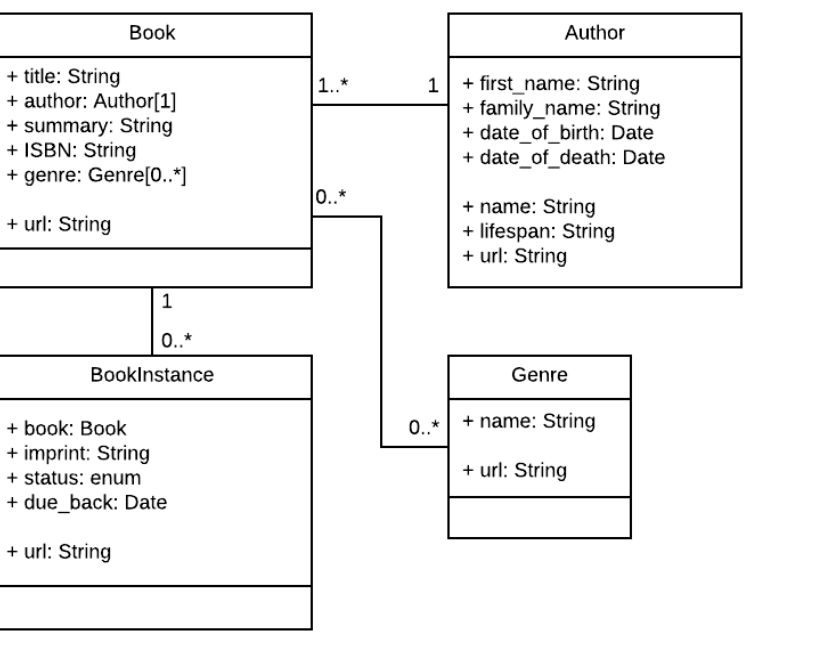

  <!-- 
 styles badge, at the end i decided to cusrom them like in the ecommercejs project
 where i had to create a styles.js file and add the styles there then export it as hook
 https://stackoverflow.com/questions/55766980/custom-color-to-badge-component-not-working
 
  <br>


Photographs for projects


FOOD and objects ----------

https://unsplash.com/@imdauphong

general
https://unsplash.com/collections/75589301/bon-apetite

https://unsplash.com/@ikredenets
https://unsplash.com/photos/Jm_SqbqZYkY
https://unsplash.com/photos/DHaZQh7hR2U

https://unsplash.com/photos/xLS_W6RVx-8

https://unsplash.com/@wendish

https://unsplash.com/@stilclassics

https://unsplash.com/@charlesdeluvio

Christmas
https://unsplash.com/@samhoajti


PLACES ---------

https://unsplash.com/@spoelee4


PEOPLE ---------

https://unsplash.com/photos/BVJ5e-Z2zEk
https://unsplash.com/photos/n3GxXpVcTpI

beautiful black women
https://unsplash.com/@raphaellovaski
https://unsplash.com/photos/88IOcZz53eg
https://unsplash.com/photos/Tfbw4CFFPaY

https://unsplash.com/photos/DTdkZzXYhKI

https://unsplash.com/@dynamicwang
https://unsplash.com/photos/ISrx6MJ7XXI

---

https://unsplash.com/@kirsimakov

---

https://unsplash.com/@ronmcclenny

---

https://unsplash.com/photos/WJ85c_l6JSE

---

https://unsplash.com/photos/aU_eOcelLhQ


# 🐝

# Let's Begin!

## 1. Install the dependencies

```javascript
// copy and paste the following
npm install @material-ui/core @material-ui/icons   react-router-dom node-sass@4.14.1 styled-components

// npm i styled-components
```

 <br>


### Lets start by creating the pages folder

- create the pages folder
- inside of it, create the Home.jsx

<br>

> Here you can see how the [**emmet extension**](https://code.visualstudio.com/docs/editor/emmet) auto complete and automatically create the import on top of the file

 
<br>

 
 
  []()
  -->

# 🍯

<!-- phase 2 after, default 1 -->

# ROUTES / COLLECTIONS

<br>
<br>

### Now that we know how routes work, let's create the <u>COLLECTIONS</u> in mongoDB

<br>

> **The collections** are going to match with the pages we have in the [frontend](https://github.com/nadiamariduena/react-mern-21-frontend), such as the **USER |CART | ORDER | PRODUCT**

 <br>
 <br>

### START by creating a new folder:

- Create the folder in the same directory as the node modules(not inside the node_modules)

- Call the folder: **models**

<br>

##### Inside the models folder create:

- User.js (dont confuse the user with the user inside the **routes folder**)
- Product.js
- Order.js
- Cart.js

<br>
<br>
<br>

## Inside the User.js create the Schema

[]()

<br>

### THE SCHEMA / MODEL

> **A document schema is a JSON object that allows you to define the shape and content of documents and embedded documents in a collection.** ... Document schemas follow the same JSON schema specification as document validation in the MongoDB server.

<br>

#### Defining and creating models

> Models are defined using the Schema interface. **The Schema allows you to define the fields stored in each document along with their validation requirements and default values.** In addition, you can define static and instance helper methods to make it easier to work with your data types, and also virtual properties that you can use like any other field, but which aren't actually stored in the database (we'll discuss a bit further below).

- Schemas are then "compiled" into models using the mongoose.model() method. Once you have a model you can use it to find, create, update, and delete objects of the given type.

[](https://developer.mozilla.org/en-US/docs/Learn/Server-side/Express_Nodejs/mongoose)

<br>
<br>

# 🍯

#### FIRST WE WILL START BY STRUCTURING THE USER SCHEMA AND FROM THERE. WE WILL SET UP THEN THE USER AUTHENTICATION.

- the Schema below will serve to structure the users data

##### [check another example i did few months ago](https://github.com/nadiamariduena/ecommerce2/blob/master/src/docs/USER_AUTH.md)

<br>

- You have to always use **CAPITAL** in the name of your Schema:

```javascript
const UserSchema;
```

<br>

<br>

#### I added something more to the schema, lets see if i get errors when i will try it in POSTMAN

<br>

- I added **firstname** and **lastName** in more of what you can see in the [video tutorial](https://www.youtube.com/watch?v=rMiRZ1iRC0A). min 23:05

<br>

```javascript
const mongoose = require("mongoose");

const userShema = new mongoose.Schema({
  firstName: {
    type: String,
    required: true,
    trim: true,
    min: 3,
    max: 20,
  },
  lastName: {
    type: String,
    required: true,
    trim: true,
    min: 3,
    max: 20,
  },
  userName: {
    type: String,
    required: true,
    trim: true,
    unique: true, //unique:we cannot create another username with the same username
    lowercase: true,
  },
  email: { type: String, required: true, unique: true },
  password: { type: String, required: true },
  isAdmin: {
    type: boolean, //because its going to be: TRUE or FALSE
    default: false, // since its false, this user is NOT going to be an Admin
  },
});
```

<br>

#### Here we are telling that 'This user' is not going to be an Admin: default: false

```javascript
isAdmin: {
    type: boolean, //because its going to be: TRUE or FALSE
    default: false, // since its false, this user is NOT going to be an Admin
}
```

<br>

#### A last thing

- add the following:

```javascript
createAt: Date.now();
```

### ⚠️

#### But we dont have to do this, since Mongo has a function for that:

```javascript
  },
  { timestamps: true }
);
```

<br>

#### What is timestamps true in mongoose?

> The {timestamps: true} option creates a createdAt and updatedAt field on our models that contain timestamps which will get automatically updated when our model changes. The last line mongoose. model('User', UserSchema); registers our schema with mongoose.

##### [Check the differences with & without](https://dev.to/iamharsh/comment/ohl0)

<br>
<br>

### Now that we have the basic Schema, lets export it!

> Here we export the Schema:

- 2 important things to not mess up with here: 🔴

- **"User"**, **UserSchema**

> **module.exports** = mongoose.model(**"User"**, **UserSchema**);

<br>
  <br>

```javascript
const mongoose = require("mongoose");

<br></br>;

const UserSchema = new mongoose.Schema(
  {
    firstName: {
      type: String,
      required: true,
      trim: true,
      min: 3,
      max: 20,
    },
    lastName: {
      type: String,
      required: true,
      trim: true,
      min: 3,
      max: 20,
    },
    userName: {
      type: String,
      required: true,
      trim: true,
      unique: true, //unique:we cannot create another username with the same username
      lowercase: true,
    },
    email: { type: String, required: true, unique: true },
    password: { type: String, required: true },
    isAdmin: {
      type: boolean, //because its going to be: TRUE or FALSE
      default: false, // since its false, this user is NOT going to be an Admin
    },
  },
  { timestamps: true }
);

//
// Here we export the Schema:
module.exports = mongoose.model("User", UserSchema);
```

<br>
<br>
<br>

#### Now that we are done with the USER model, lets create another one.

- COPY the Schema fron the USER and paste it inside the Product.js

<br>

#### Replace certain things:

<br>

```javascript

```
