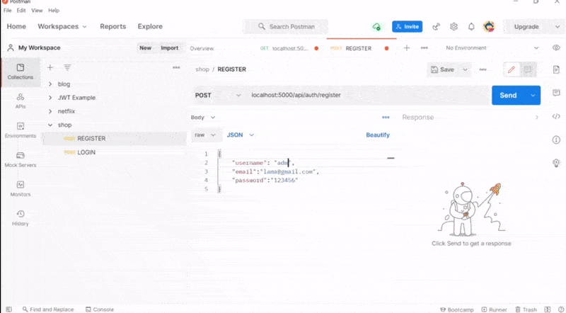
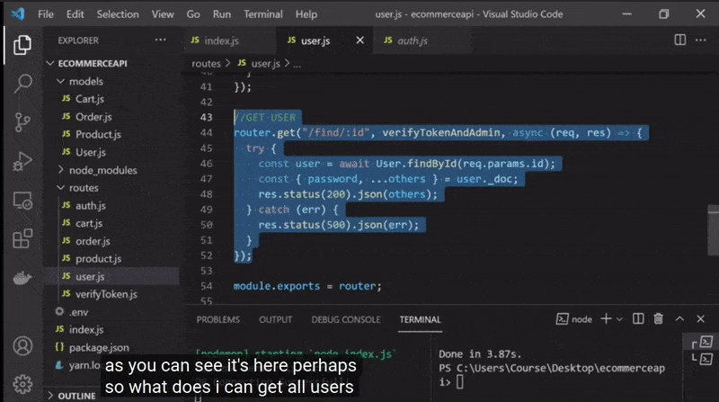
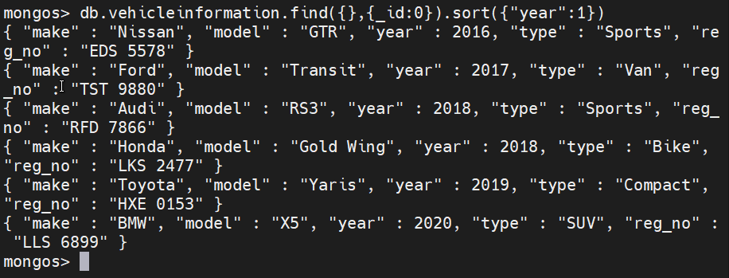
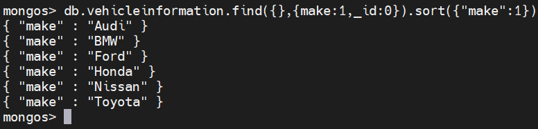
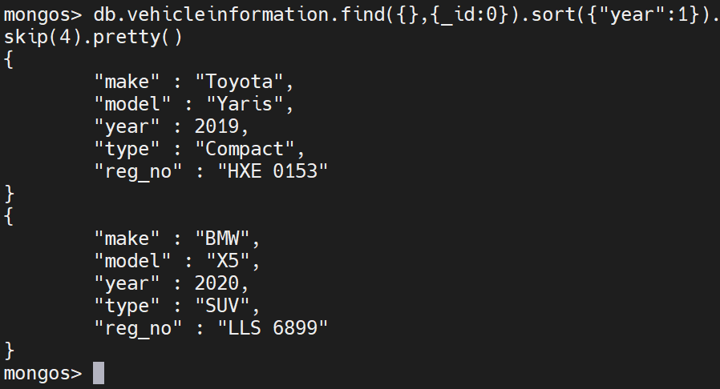
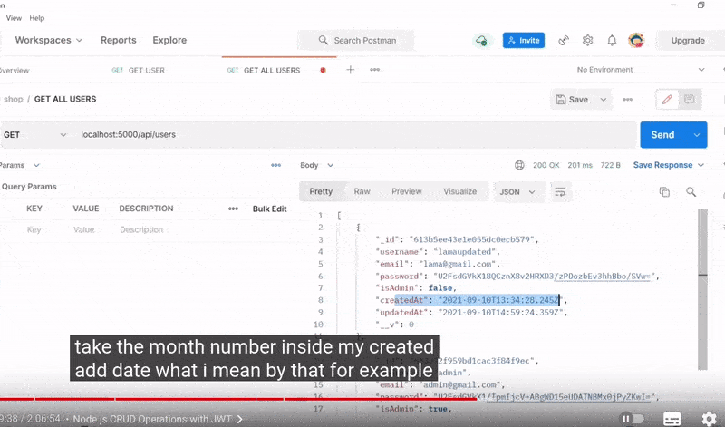

 <!-- 
 styles badge, at the end i decided to custom them like in the commercejs project
 where i had to create a styles.js file and add the styles there then export it as hook
 https://stackoverflow.com/questions/55766980/custom-color-to-badge-component-not-working
 
  <br>


Photographs for projects


FOOD and objects ----------

https://unsplash.com/@imdauphong

general
https://unsplash.com/collections/75589301/bon-apetite

https://unsplash.com/@ikredenets
https://unsplash.com/photos/Jm_SqbqZYkY
https://unsplash.com/photos/DHaZQh7hR2U

https://unsplash.com/photos/xLS_W6RVx-8

https://unsplash.com/@wendish

https://unsplash.com/@stilclassics

https://unsplash.com/@charlesdeluvio

Christmas
https://unsplash.com/@samhoajti


PLACES ---------

https://unsplash.com/@spoelee4


PEOPLE ---------

https://unsplash.com/photos/BVJ5e-Z2zEk
https://unsplash.com/photos/n3GxXpVcTpI

beautiful black women
https://unsplash.com/@raphaellovaski
https://unsplash.com/photos/88IOcZz53eg
https://unsplash.com/photos/Tfbw4CFFPaY

https://unsplash.com/photos/DTdkZzXYhKI

https://unsplash.com/@dynamicwang
https://unsplash.com/photos/ISrx6MJ7XXI

---

https://unsplash.com/@kirsimakov

---

https://unsplash.com/@ronmcclenny

---

https://unsplash.com/photos/WJ85c_l6JSE

---

https://unsplash.com/photos/aU_eOcelLhQ


# 🐝

# Let's Begin!

## 1. Install the dependencies

```javascript
// copy and paste the following
npm install @material-ui/core @material-ui/icons   react-router-dom node-sass@4.14.1 styled-components

// npm i styled-components
```

 <br>


### Lets start by creating the pages folder

- create the pages folder
- inside of it, create the Home.jsx

<br>

> Here you can see how the [**emmet extension**](https://code.visualstudio.com/docs/editor/emmet) auto complete and automatically create the import on top of the file

 
<br>

 
 
  []()
  


  
  https://code.visualstudio.com/docs/editor/workspace-trust
  

  Un "Bearer Token" est un JSON Web Token dont le rôle est d'indiquer que l'utilisateur qui accède aux ressources est bien authentifié. ... Cet attribut permet d'indiquer que l'accès à ce controller (et donc les méthodes qui le composent) ne peut se faire que si l'utilisateur est authentifié.
------------------------


What is req body in Express?


The req. body object allows you to access data in a string or JSON object from the client side. You generally use the req. body object to receive data through POST and PUT requests in the Express server. ... body object into the console results in the user's email and password.

  -->

# 🐻

<!-- phase 2 after, default 1 -->

# 1. ADMIN function

## 2. DELETE router

<br>
<hr>
<br>

# ADMIN ✋

<br>

- Since only admin can add any products, we have to create a function that allows **the admin only** to create products.

- Go to the verifyToken.js to add the following function.

```javascript
//verifyToken.js
// -------------------------------------------
//                  3
//              VERIFY ADMIN
//    Only the admin can create products
//
// -------------------------------------------
//
const verifyTokenAndAdmin = (req, res, next) => {
  verifyToken(req, res, () => {
    //1 if the user is admin
    if (req.user.isAdmin) {
      // 2 we are going to continue the function
      next();
    } else {
      res.status(403).json("Only Admin is allowed add a product");
    }
  });
};

module.exports = {
  verifyToken,
  verifyTokenAndAuthorization,
  verifyTokenAndAdmin,
};
```

<br>
<hr>
<br>

# DELETE ✋ METHOD

<br>

### Now create the Delete router

<br>

#### Go to the user.js and create the 'delete router'

```javascript
// user.js
//---------------------------------
//            DELETE
//---------------------------------
//
//
//
router.delete("/:id", verifyTokenAndAuthorization, async (req, res) => {
  //
  // Here we will find and delete
  //  that specific User/ and all the
  // schema data that this User contains
  try {
    await User.findByIdAndDelete(req.params.id);
    res.status(200).json("User has been deleted");
  } catch (err) {
    res.status(500).json(err);
  }
});

module.exports = router;
```

<br>
<hr>
<br>

# GET 🖐️ METHOD /VERIFY ADMIN

### Now create the GET router

- but before lets go back to the **auth.js** and COPY the following line 'as its showing all the information of the user', and we dont want that for what we are going to do, so to **prevent that, we will have to destructure it**

<br>

- Go to the **user.js** and **paste this 2 lines** there, then change few things.

<br>

```javascript
// copy this from the auth.js
//
//  REPLACE THIS:
//2 lines
const { password, ...others } = user._doc;
res.status(200).json({ ...others, accessToken });
//
//
//
//      and PASTE it inside the user.js
const { password, ...others } = user._doc;
//._doc; will grab the user data from the object in mongoDb
//
res.status(200).json({ others });
```

<br>
<br>

## Now write another end point to get the user id

```javascript
//
// before
router.get("/:id",
//
// after
router.get("/find/:id",
```

<br>
<br>

### Now lets test it

- Go to postman and type the following inside the url

- log in (with your last user)
- grab the token
- grab the user id
- change the method from PUT to GET

[]()

<br>

## This is what we have so far:

##### user.js

```javascript
// user.js
//
//
//---------------------------------
//           GET user
//  only the Admin get the user
//---------------------------------
//
router.get("/find/:id", verifyTokenAndAdmin, async (req, res) => {
  //

  try {
    // Find it throught the Id
    const user = await User.findById(req.params.id);

    const { password, ...others } = user._doc;
    //._doc; will grab the user data from the object in mongoDb
    //
    res.status(200).json({ others });
  } catch (err) {
    res.status(500).json(err);
  }
});
//
//
module.exports = router;
```

# VERIFY ADMIN 🔑

##### verifyToken.js

```javascript
//
//
// -------------------------------------------
//                  3
//              VERIFY ADMIN
//    Only the admin can create products
//
// -------------------------------------------
//
const verifyTokenAndAdmin = (req, res, next) => {
  verifyToken(req, res, () => {
    //1 if the user is admin
    if (req.user.isAdmin) {
      // 2 we are going to continue the function
      next();
    } else {
      res.status(403).json("You are not allowed to do that");
    }
  });
};

module.exports = {
  verifyToken,
  verifyTokenAndAuthorization,
  verifyTokenAndAdmin,
};
```

<br>
<hr>
<br>

# ADMIN TEST

### Now lets make the user ADMIN, type the following in POSTMAN

- Create a new user in postman using the **REGISTER**

```javascript
{
"username": "admin1",
"email": "admin1@gmail.com",
"password": "blero2n2"
 }
```

#### result:

- If you notice the **"isAdmin":** is **FALSE**

```javascript
{
    "username": "admin1",
    "email": "admin1@gmail.com",
    "password": "longcode",
    "isAdmin": false,
    "_id": "longcode",
    "createdAt": "2021-11-17T23:59:34.499Z",
    "updatedAt": "2021-11-17T23:59:34.499Z",
    "__v": 0
}
```

<br>

### To make a USER an ADMIN, we will have to go to MONGO and edit the permission there:

- Once we edit the Admin from **false to true**, we will see if its working.

##### Here we will use the id of a "normal user or not admin", in the url

<br>

```javascript
http://localhost:4000/api/users/find/61959c3f76557e19b666b95a
// this url is from another user who is not an admin
```

<br>

#### Now we will add the token of an admin, so to have 2 opposite datas

[]()

<br>

<br>

- As you can see, at the end of the GIF it didnt work, as the identity or user id **doesnt correspond to the admin**.

<br>
<hr>
<br>

# GET ALL USERS

<br>

- Go to the **user.js**, copy the GET function, duplicate it and paste it under the **GET** function

<br>

- replace this 👍

```javascript
// replace this
router.get("/find/:id",
//
//
// for this
router.get("/",
```

##### also

```javascript
//---------------------------------
//           GET all users
//---------------------------------
//
//
//  REPLACE THIS:
//
router.get("/find/:id", verifyTokenAndAdmin, async (req, res) => {
  try {
    // Find the user(you need of specific .findById() method to find it)
    const user = await User.findById(req.params.id);
    // grab the password and ...all the data exe. 'others'
    const { password, ...others } = user._doc;
    //._doc; will grab the user data from the object in mongoDb
    res.status(200).json({ others });
  } catch (err) {
    res.status(500).json(err);
  }
});
//
//

module.exports = router;
//
//
//  FOR THIS:
//
//
//---------------------------------
//           GET all users
//---------------------------------
//
router.get("/", verifyTokenAndAdmin, async (req, res) => {
  try {
    // Find all the user(no need of specific .findById() method)
    const users = await User.find();
    //
    res.status(200).json(users);
  } catch (err) {
    res.status(500).json(err);
  }
});
//
//

module.exports = router;
```

<br>

### NOW GO TO POSTMAN and register the 'get' request we were working on then duplicate it as you see on the GIF:

<br>

- if you want to have the possibility to slow down the gif, convert it to mp4 video.(from gif to video)

<br>

[]()

- As you can see **after the duplication**, when you delete the id of the other user and you just keep this **/** , you will get all the users (at the right bar)

#### But what happen if we want to get any 'query': /users?new=true

- In this case it s going to return only the latest 5 users

```javascript
// GET
http://localhost:4000/api/users?new=true
```

#### Lets implement it in the App

- to get the **'latest users'** we will do go to the **user.js** and write the following:

```javascript
const query = req.query.new;
```

#### then write the following condition:

##### if there is a query...

```javascript
//  If there is a query, go inside User and find 5
// if you want to change it, its up to you!
query ? await User.find().limit(5)
```

##### if there isn't any query...

```javascript
// if there is no query : then return 'all the users'
: await User.find();
```

<br>

# 🍯

#### But if we do it like that, its going to give us 5 users, we can add .sort() to get the last user (alphabetically)

```javascript
// The sort() method sorts an array alphabetically:
const users = query
  ? await User.find().sort({ _id: -1 }).limit(1)
  : await User.find();
```

<br>

# sort() method in Mongo

##### Sorted collection

> To get a sorted result, we append the sort() method to the end of the search query (find() method). This allows the user to generate a sorted output.

- In this instance, the data is sorted by the “year” field in ascending order.

```javascript
db.vehicleinformation.find({}, { _id: 0 }).sort({ year: 1 });
```

<br>

- The [**{\_id:0}**](https://www.bmc.com/blogs/mongodb-sorting/) operator is used to remove the document ID for a simpler output.

<br>

#### result

[]()

##### source: [MongoDB Sorting: sort() Method & Examples](https://www.bmc.com/blogs/mongodb-sorting/)

<br>

> **Using the sort() method will increase the readability of a query**, which leads to a better understanding of a given dataset. Not only that, sorted data will be used by developers to write more complex algorithms.

<br>

### What is database sorting?

Database **sorting presents data in an ascending or descending order** with relation to the data in a specified field. You can carry out sorting operations on various data types such as:

- Strings
- Integers
- Decimal
- Etc.

#### MongoDB sort()

In MongoDB, sorting is done by the sort() method. The sort() method consists of two basic building blocks. These building blocks are fields to be sorted and the sort order.

> The sorting order in MongoDB is defined by either a **one (1)** or a **minus (-1)**. Here

- the **positive one represents the ascending order**, while
- the **negative one represents the descending order**.

<br>

#### source: [MongoDB Sorting: sort() Method & Examples](https://www.bmc.com/blogs/mongodb-sorting/)

<br>
<br>

### So to see it in our app, I have the following 2 items but I will add a new one, I will name it 'cloud' just to see the behavior.

<br>

#### THE LIST

- cloud is the latest user

```javascript
[
  {
    _id: "6195976696da42f92065e7e7",
    username: "admin",
    email: "admin@gmail.com",
    password: "U2FsdGVkX19briYBcIhkrK0GkpMzYZTUwB4C0TGcd3Q=",
    isAdmin: true,
    createdAt: "2021-11-17T23:59:34.499Z",
    updatedAt: "2021-11-17T23:59:34.499Z",
    __v: 0,
  },
  {
    _id: "61959c3f76557e19b666b95a",
    username: "adminoo",
    email: "admino@gmail.com",
    password: "U2FsdGVkX1+IfsgQUkhmA4yhGhU1ymgegogQmX/4Gvs=",
    isAdmin: false,
    createdAt: "2021-11-18T00:20:15.921Z",
    updatedAt: "2021-11-18T00:20:15.921Z",
    __v: 0,
  },
  {
    _id: "6195b105f6fe5a41cdfd5654",
    username: "cloud",
    email: "cloud@gmail.com",
    password: "U2FsdGVkX18+8HirA2/hhTGjgQaMTX+HxF0X9QBApO4=",
    isAdmin: false,
    createdAt: "2021-11-18T01:48:53.242Z",
    updatedAt: "2021-11-18T01:48:53.242Z",
    __v: 0,
  },
];
```

<br>

#### Now let's understand this line, after what we just read here:

> The sorting order in MongoDB is defined by either a **one (1)** or a **minus (-1)**.

- the **positive one represents the ascending order**, while
- the **negative one represents the descending order**.

```javascript
.find().sort({ _id: -1 }).limit(1)
```

#### if we add the -1 it will.sort(and give is the descending order -1)

- which is:

```javascript
[
  {
    _id: "6195b105f6fe5a41cdfd5654",
    username: "cloud",
    email: "cloud@gmail.com",
    password: "U2FsdGVkX18+8HirA2/hhTGjgQaMTX+HxF0X9QBApO4=",
    isAdmin: false,
    createdAt: "2021-11-18T01:48:53.242Z",
    updatedAt: "2021-11-18T01:48:53.242Z",
    __v: 0,
  },
];
```

#### Now what happens if we remove the minus -1?

```javascript
.find().sort({ _id: 1 }).limit(1)
```

- It will give us this:

```javascript
// the first one
[
  {
    _id: "6195976696da42f92065e7e7",
    username: "admin",
    email: "admin@gmail.com",
    password: "U2FsdGVkX19briYBcIhkrK0GkpMzYZTUwB4C0TGcd3Q=",
    isAdmin: true,
    createdAt: "2021-11-17T23:59:34.499Z",
    updatedAt: "2021-11-17T23:59:34.499Z",
    __v: 0,
  },
];
```

### And what happens if we add the 1 and 5 limit?

- it will sort it alphabetically

```javascript
[
  {
    _id: "6195976696da42f92065e7e7",
    username: "admin",
    email: "admin@gmail.com",
    password: "U2FsdGVkX19briYBcIhkrK0GkpMzYZTUwB4C0TGcd3Q=",
    isAdmin: true,
    createdAt: "2021-11-17T23:59:34.499Z",
    updatedAt: "2021-11-17T23:59:34.499Z",
    __v: 0,
  },
  {
    _id: "61959c3f76557e19b666b95a",
    username: "adminoo",
    email: "admino@gmail.com",
    password: "U2FsdGVkX1+IfsgQUkhmA4yhGhU1ymgegogQmX/4Gvs=",
    isAdmin: false,
    createdAt: "2021-11-18T00:20:15.921Z",
    updatedAt: "2021-11-18T00:20:15.921Z",
    __v: 0,
  },
  {
    _id: "6195b105f6fe5a41cdfd5654",
    username: "cloud",
    email: "cloud@gmail.com",
    password: "U2FsdGVkX18+8HirA2/hhTGjgQaMTX+HxF0X9QBApO4=",
    isAdmin: false,
    createdAt: "2021-11-18T01:48:53.242Z",
    updatedAt: "2021-11-18T01:48:53.242Z",
    __v: 0,
  },
];
```

### And what happens if we add the -1 and 5 limit?

```javascript
[
  {
    _id: "6195b105f6fe5a41cdfd5654",
    username: "cloud",
    email: "cloud@gmail.com",
    password: "U2FsdGVkX18+8HirA2/hhTGjgQaMTX+HxF0X9QBApO4=",
    isAdmin: false,
    createdAt: "2021-11-18T01:48:53.242Z",
    updatedAt: "2021-11-18T01:48:53.242Z",
    __v: 0,
  },
  {
    _id: "61959c3f76557e19b666b95a",
    username: "adminoo",
    email: "admino@gmail.com",
    password: "U2FsdGVkX1+IfsgQUkhmA4yhGhU1ymgegogQmX/4Gvs=",
    isAdmin: false,
    createdAt: "2021-11-18T00:20:15.921Z",
    updatedAt: "2021-11-18T00:20:15.921Z",
    __v: 0,
  },
  {
    _id: "6195976696da42f92065e7e7",
    username: "admin",
    email: "admin@gmail.com",
    password: "U2FsdGVkX19briYBcIhkrK0GkpMzYZTUwB4C0TGcd3Q=",
    isAdmin: true,
    createdAt: "2021-11-17T23:59:34.499Z",
    updatedAt: "2021-11-17T23:59:34.499Z",
    __v: 0,
  },
];
```

<br>

### RECAPITULATING:

<br>

### Sorting in ascending order

In this example, I use the “make” text field to obtain the results in ascending order. The operator one ({“make”:1}) is used to indicate the ascending order, and MongoDB projection is used to filter out all the other fields except the “make” field.

```javascript
db.vehicleinformation.find({}, { make: 1, _id: 0 }).sort({ make: 1 });
```

[]()

<br>

#### Sorting with the skip() method

> You can also use the skip() method with the sort() method. The skip() method allows the user to skip a specified number of documents from the resulting dataset.

In the following example, You can see the first four documents are being skipped while being sorted by the year in ascending order.

```javascript
db.vehicleinformation.find({}, { _id: 0 }).sort({ year: 1 }).skip(4).pretty();
```

<br>

#### source: [MongoDB Sorting: sort() Method & Examples](https://www.bmc.com/blogs/mongodb-sorting/)

<br>
<br>

[]()

<br>
<br>

#### Before continuing lets see what we have:

```javascript
//---------------------------------
//           GET all users
//---------------------------------
//
router.get("/", verifyTokenAndAdmin, async (req, res) => {
  const query = req.query.new;

  try {
    // Find all the user(no need of specific .findById() method)
    const users = query
      ? await User.find().sort({ _id: 1 }).limit(1)
      : await User.find();
    //
    res.status(200).json(users);
  } catch (err) {
    res.status(500).json(err);
  }
});
//
//

module.exports = router;
```

<br>
<br>
<hr>
<br>

# 📆

### Now lets continue with the STATS

- The stats are going to return the stats of the users per month: **lets say that in september we got 10 users and november 2**. Also we will limit them (in case we don't care about last year users)

<br>

- We will use again the **-1** to return the last today

```javascript
//---------------------------------
//           GET STATS
//---------------------------------
//
router.get("/stats", verifyTokenAndAdmin, async (req, res) => {
  const date = new Date();
  // We will use again the **-1** to return the last year today
  const lastYear = new Date(date.setFullYear(date.getFullYear() - 1));
  //
  //
});
//
```

## Since we are going to use statistics per 'month', we should GROUP our items.

#### to do that we will be using:

> **mongoDB: _AGGREGATE_**

<br>

<hr>

#### What is a MongoDB aggregation?

> In MongoDB, **aggregation operations** process the data records/documents and return computed results. It collects values from various documents and groups them together and then performs different types of operations on that grouped data like sum, average, minimum, maximum, etc to return a computed result.

### Aggregation

Posted on: 09/06/2020 (last updated: 27/08/2021) by Juan Roy Couto
When you start with MongoDB, you will use the find() command for querying data and it will probably be sufficient, but as soon as you start doing anything more advanced than data retrieval, you will need to know more about the MongoDB aggregation pipeline.

<br>

- **$match()** stage – filters those documents we need to work with, those that fit our needs
- **$group()** stage – does the aggregation job
- **$sort()** stage – sorts the resulting documents the way we require (ascending or descending)

#### read more: [Aggregation](https://studio3t.com/knowledge-base/articles/mongodb-aggregation-framework/)

<hr>

#### So As i was saying:

> The stats are going to return the stats of the users per month: **lets say that in september we got 10 users and november 2**. Also we will limit them (in case we don't care about last year users)

#### NOw lets see how the <u>Aggregation</u> will work here:

- **remember:** **$match()** stage – filters those documents we need to work with, those that fit our needs.

<br>
<br>

## 1. $GTE

```javascript
/*

try { ✋
  const data = await User.aggregate([
    // 
    //1 here we are going to try to $match the condition
    //the condition is: createdAt, because if you see
    // the object in mongo, every user has an update, and in the
    // condition we are going to say less than today and 'greater $gte' than last year

    // ✋
    { $match: { createdAt: { $gte: lastYear } } },
  ]);

  //
} catch (err) {}


*/
```

<br>

#### What is $GTE in MongoDB?

> **$gte selects the documents where the value of the field is greater than or equal** to (i.e. >= ) a specified value (e.g. value .) ... This update() operation will set the value of the price field that contain the embedded document carrier whose fee field value is greater than or equal to 2

<br>
<br>

## 2. $project

> The $project stage is extremely useful for filtering a document to show only the fields we need:

##### [MongoDB $project Example | The MongoDB Aggregation Pipeline](https://studio3t.com/knowledge-base/articles/mongodb-project-aggregation-stage/)

<br>

```javascript
      // 2 and I want to take months number
      // what we are saying here below is: take the $month number inside the mongo object: 'createdAt' date
   {
        $project: {
          month: { $month: "$createdAt" },
        },
      },
```

[]()

<br>
<br>

```javascript
//---------------------------------
//           GET STATS
//---------------------------------
//
router.get("/stats", verifyTokenAndAdmin, async (req, res) => {
  const date = new Date();
  // We will use again the **-1** to return the last year today
  const lastYear = new Date(date.setFullYear(date.getFullYear() - 1));
  //
  try {
    const data = await User.aggregate([
      //1 here we are going to try to $match the condition
      //the condition is: createdAt, because if you see
      // the object in mongo, every user has an update, and in the
      // condition we are going to say less than today and 'greater $gte' than last year
      { $match: { createdAt: { $gte: lastYear } } },
      // 2 and I want to take months number
      // what we are saying here below is: take the month number
      // inside the mongo 'createdAt' date
      {
        $project: {
          // take the month number, inside the created update

          month: { $month: "$createdAt" },
        },
      },

      // AFTER the $project we can 'group' the items, the users
      /*
      If used on a field that contains both numeric and non-numeric values, $sum ignores the non-numeric values and returns the sum of the numeric values.
      
      */
      {
        $group: {
          _id: "$month",
          total: { $sum: 1 },
        },
      },
      //
    ]);
    //
    res.status(200).json(data);
    //
  } catch (err) {}
  //
});
//

//
//

module.exports = router;
```

<br>

#### What is $sum in MongoDB?

> If used on a field that contains both numeric and non-numeric values, $sum ignores the non-numeric values and returns the sum of the numeric values. If used on a field that does not exist in any document in the collection, $sum returns 0 for that field. If all operands are non-numeric, $sum returns 0 .

#### [$sum](https://docs.mongodb.com/manual/reference/operator/aggregation/sum/)

<br>

### Result

#### IN the video tutorial is different because his test in mongo was done in 09, mine was done in November

```javascript
[
  {
    _id: 11, //the month
    //s
    //the sum result
    total: 3, //3 objects/users in my collection
  },
];
//
//
//
// this is how i have it in mongo
_id:6195b105f6fe5a41cdfd5654
username:"cloud"
email:"cloud@gmail.com"
password:"U2FsdGVkX18+8HirA2/hhTGjgQaMTX+HxF0X9QBApO4="
isAdmin:false
// the part we were working now:
createdAt:2021-11-18T01:48:53.242+00:00
updatedAt:2021-11-18T01:48:53.242+00:00
__v:0
```

#### LETS change the month inside mongo, so to see a different outcome

- Go to mongo and change/edit the month of one of the objects/users, so that we have one from july for example

```javascript
isAdmin:false
createdAt:2021-07-18T00:20:15.921+00:00
updatedAt:2021-11-18T00:20:15.921+00:00
```

<br>

- now update it again in **POSTMAN**

### result

```javascript
[
  {
    _id: 11,
    total: 2,
  },
  {
    _id: 7,
    total: 1,
  },
];
```

### what happens if we change the YEAR?

```javascript
createdAt:2020-07-18T00:20:15.921+00:00
updatedAt:2021-11-18T00:20:15.921+00:00
__v
:0
```

<br>

#### result

```javascript
[
  {
    // we have 2 users for 2021
    _id: 11,
    total: 2,
  },
];
```

#### if we want to see the users for 2020 and also the 2021 we should do this

```javascript
(date.getFullYear() - 2));
```

#### result

```javascript
[
  // 2021 , we have 2 users
  {
    _id: 11,
    total: 2,
  },
  // 2020 , we have 1 user
  {
    _id: 7, //month
    total: 1,
  },
];
```

<br>
<br>

### In the next section we will be creating the product set up so that we can add products.
