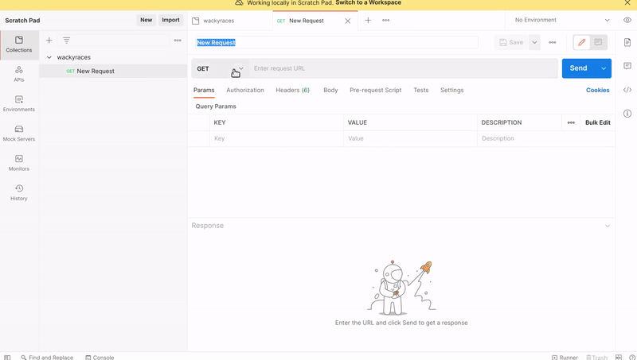
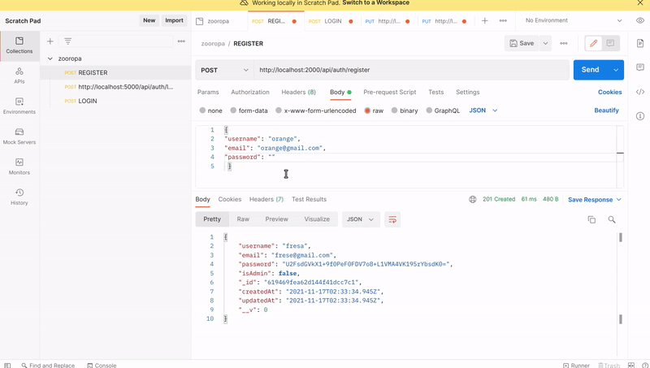

# COMMON ERRORS

> When you will start testing in POSTMAN, careful with the colons, brackets or any little mistake as it will create stupid errors that have nothing to do with the code

<br>
<br>
<br>
<br>
<br>

# 🔴 error no.1

#### I get this error sometimes when i do some changes in VS

<br>

```javascript
node:events:356
      throw er; // Unhandled 'error' event
      ^

Error: listen EADDRINUSE: address already in use :::3000
    at Server.setupListenHandle [as _listen2] (node:net:1312:16)
    at listenInCluster (node:net:1360:12)
    at Server.listen (node:net:1447:7)
    at Function.listen (/home/dci-st119/Documents/3D-UNITY-BLENDER-REACTVR-ALL/A_REACT_interme/react-mern-21-backend/node_modules/express/lib/application.js:618:24)
    at Object.<anonymous> (/home/dci-st119/Documents/3D-UNITY-BLENDER-REACTVR-ALL/A_REACT_interme/react-mern-21-backend/index.js:51:5)
    at Module._compile (node:internal/modules/cjs/loader:1108:14)
    at Object.Module._extensions..js (node:internal/modules/cjs/loader:1137:10)
    at Module.load (node:internal/modules/cjs/loader:973:32)
    at Function.Module._load (node:internal/modules/cjs/loader:813:14)
    at Function.executeUserEntryPoint [as runMain] (node:internal/modules/run_main:76:12)
Emitted 'error' event on Server instance at:
    at emitErrorNT (node:net:1339:8)
    at processTicksAndRejections (node:internal/process/task_queues:81:21) {
  code: 'EADDRINUSE',
  errno: -98,
  syscall: 'listen',
  address: '::',
  port: 3000
}
```

<br>

## Reason

[nodejs error EADDRINUSE](https://stackoverflow.com/questions/42751932/nodejs-error-eaddrinuse)

<br>

> Your site.js **tries to listen twice on that port or something (another process) is already listening on port** 3000. Find the service and stop/kill it. This command should help:

##### 1.

- lsof -i | grep 3000

<br>

##### 2.

- killall (this one worked for me)

<br>
<br>
<br>
<hr>
<br>
<br>
<br>

# 🔴 error no.2

#### I get this error when trying to send a POST REQUEST in postman

```javascript
keyPattern: {
  username: null;
}
// this error show up when you have either an item or a user with a similar data inside MONGODB or an error insid e the .env.
```

### the set up i have in postman

- the URL: **http://localhost:5000/api/auth/register**

- body
- raw
- JSON

```javascript

{
"username": "carag hol",
"email": "rajopd@gmail.com",
"password": "vvvdorejj"
 }
```

#### then I did the following:

1. created a new collection **(the reason of the mistake)**
2. I set up the POST request
3. then i added the object
4. while being connected to the **PORT 3000** (inside my index.js)
5. inside the console the **server is connected succesfully**

[]()

<br>

# 🤦

### I was doing all correctly at one exception, I messed with the variable inside the .env

- in the beginning I had another variable there , the **superFreak** as you can see it in the image(collections), then i changed it to **shop** as seen in the video tutorial, but **I DONT KNOW** if the fact of changing the variable while the server is connected **mess things up**, because after i changed the variable things went wrong.

```javascript

 ongodb.net/shop?retry
```

<br>
<br>

[]()

#### Then after many different tests, I decided to change the variable again to see if the problem came from there.

<br>

- So I shut down the server
- I changed the variable to **inspectorgadget**

```javascript

 ongodb.net/inspectorgadget?retry
```

<br>

#### steps:

- then i turned the server **on** again
- I went to postman

- created a new collection
- I set up the POST request
- then i added the object
- while being **succesfully** connected to the **PORT 3000** (inside my index.js)

> **Like so:**

[]()

<br>

## JUST TO BE SURE 🐿️

#### I deleted all again, then i repeated the 'steps' from above

- Now i am 100% the **error** came from there

### So after i deleted all a third time, i concluded that the variable you add in the .env (collection related)is the parent collection, and shouldn't be touched, this collection will be parent of all the other you will create in postman

- so when you go to postman when you just added this variable, add the specific name that is inside the **.env**, repeat the steps, and after you send the first data to **MONGO** and that all went well, after that you can add whatever child you want.

<br>
<br>

[]()

## Links related:

##### [MongoError: E11000 duplicate key error collection: test.users index: email1_1 dup key: { email1: null } [duplicate]](https://stackoverflow.com/questions/59911175/mongoerror-e11000-duplicate-key-error-collection-test-users-index-email1-1-du)

<br>

##### [MongoError code: 11000 - Internal Server Error when adding a new document using mongoose .save()](https://stackoverflow.com/questions/63916280/mongoerror-code-11000-internal-server-error-when-adding-a-new-document-using)

<br>

##### [MongoError: E11000 duplicate key error collection: users index: mobile_1 dup key: { mobile: null }](https://stackoverflow.com/questions/62169061/mongoerror-e11000-duplicate-key-error-collection-users-index-mobile-1-dup-key)

<br>
<br>
<br>
<hr>
<br>
<br>
<br>

# 🔴 error no.3

### 'MongoDB changing Ip', because of this i couldnt connect to mongo and test the "register and login"

#### It started like a normal error, I purposely mistype credentials to see what type of error i get

- This is one of them, most of time i can solve it by correcting the mistyping but sometimes the server is just too busy after the changes, so i have to kill it with this: **killall** or **pkill -f node**, or **killall -9 node** , there are **other options:** [nodemon app crashed - waiting for file changes before starting](https://stackoverflow.com/questions/37486631/nodemon-app-crashed-waiting-for-file-changes-before-starting)

```javascript
[nodemon] 2.0.14
[nodemon] to restart at any time, enter `rs`
[nodemon] watching path(s): *.*
[nodemon] watching extensions: js,mjs,json
[nodemon] starting `node index.js`
Backend server is running!
error

```

### 🔴 Unfortunately today it wasn't that easy

- I spend few hours looking for misspellings or errors in the schemas or index.js (just to be sure ), I watched the tutorial once again and i even returned 1 previous step (before the login) to figure it out but unsuccessful, then i concentrated in all the ways to kill the servers but nothing!

[nodemon app crashed - waiting for file changes before starting](https://stackoverflow.com/questions/37486631/nodemon-app-crashed-waiting-for-file-changes-before-starting)

### The reason

- then someone wrote something about the **IP in MONGO**, i didnt even think about that because i specifically added it to something familiar, but when i when to verify any possible change, i realized that **strangely i had another/new ip???** , so after i changed it back to what i had before, it worked again :)

<br>
 
##### This is what the person wrote:

> I haven't used MongoDB for more than a month. So it automatically paused the MongoDB cluster in the MongoDB cloud (atlas). I resumed the cluster and restart the application (along with a recheck of the mongo connection URL which was saved in default.json).

[nodemon app crashed - waiting for file changes before starting](https://stackoverflow.com/questions/37486631/nodemon-app-crashed-waiting-for-file-changes-before-starting)

<br>

#### After you npm start, you should have this again, only difference is that instead of error, you have 'DBConnection Successful'

```javascript
//
//        BEFORE
//
[nodemon] 2.0.14
[nodemon] to restart at any time, enter `rs`
[nodemon] watching path(s): *.*
[nodemon] watching extensions: js,mjs,json
[nodemon] starting `node index.js`
Backend server is running!
error


//
//        AFTER
//
[nodemon] 2.0.14
[nodemon] to restart at any time, enter `rs`
[nodemon] watching path(s): *.*
[nodemon] watching extensions: js,mjs,json
[nodemon] starting `node index.js`
Backend server is running!
DBConnection Successful
```

<br>
<br>
<br>
<hr>
<br>
<br>
<br>

# 🔴 error no.4

### Errors when testing the UPDATING user

- After setting up the token and the hashing of the password, i continued with the user.js, there i created the **update** router but to complete it I had to create a middleware inside a file called **verifyToken.js**.

<br>

- In there I had to create a first function, this function will be handling the middleware that is going to be used inside the user.js, this middleware contains the authentication header, with the bearer of the token.

- Then a second function that will handle the checking of the user or the admin, all to see if we have the right credentials to proceed with an update.

#### the error

- I had placed a line of code wrongly but then i realize that the problem wasnt just that, but a combination of things.

<br>

> So found One error, due to this I didnt get the data from the user, instead I got a **"token is not valid"**, so I started checking everything and all was fine but the following line of code.

```javascript
  const token = authHeader.split("")[1];
  if (authHeader) {
    //   successful

// replace for this

  //   4
  if (authHeader) {
    //   successful
    const token = authHeader.split(" ")[1];
```

<br>

### Follow this steps so that you dont waste time in postman:

<br>

#### Also, check that you have a space between the quotation marks as it represent the space between the bearer and the token code (in postman)

```javascript
const token = authHeader.split(" ")[1];
```

#### ⚠️ Be aware that when you refresh in Visual Studio, changes may cause postman to behave, so for precaution:

- Every time you save in VS code while you are testing in postman, log in your user (in postman) so to **obtain a new token**

- this new token will be used again inside the header there like in the picture below:

- So when you 'write' Bearer make 1 space(space bar) and then paste the code, check that the url is correct

<br>

[]()

```javascript
// this is the user code:61946be245b0cef659dbe1bb
// you get that code after you register a new user but only when you LOG IN (check the image below)
//
// URL
 http://localhost:2000/api/users/paste the user code here
```

- Dont **re use** PUT requests in postman, its better to create a new request so that there is no issues

<br>

- Avoid saving or making requests in postman when you are in the readme file, to me it causes issues 'sometimes'

<br>

- **careful** when adding the token as sometimes you can confuse the authorization and the headers (as they look similar), and by mistake you add the token inside the "Authorization" instead of the "Headers"

<br>
<br>
<hr>
<br>

# 🔴 error no.5

## CREATING A NEW PRODUCT

##### Duplication related ✋

##### If you try to register and log in with a new admin, a(dd the token and the user id in all the requests:POST GET etc) but then you forget to delete the product inside the mongodb, a product that was created with a now deleted user, you will have something like this:

```javascript
{
    "index": 0,
    "code": 11000,
    "keyPattern": {
        "title": 1
    },
    "keyValue": {
        "title": "alexander mcqueen"
    }
}
```

- Just delete the product and create a new product with a new Admin user.

<br>
<br>
<hr>
<br>

# 🔴 error no.6

<br>

### CORS AND SERVER ISSUE

You can follow the whole process [here](https://github.com/nadiamariduena/test-transaction-mern2021)

<br>

- I will not give a short solution here, so please read the whole process.

<br>

> **What are Axios?** <br>
> Axios: Axios is a Javascript library used to make HTTP requests from node. js or XMLHttpRequests from the browser and it supports the Promise API that is native to JS ES6. It can be used intercept HTTP requests and responses and enables client-side protection against XSRF **(Cross-Site-Request-Forgery)**. It also has the ability to cancel requests.

<br>

# 🍌

#### What is the difference between CSRF and XSRF?

- Cross-site scripting (or XSS) allows an attacker to execute arbitrary JavaScript within the browser of a victim user.

- Cross-site request forgery (or CSRF) allows an attacker to induce a victim user to perform actions that they do not intend to.

<br> <br>

**Why is Axios used?** <br> <br> Axios is a popular, promise-based HTTP client that sports an easy-to-use API and can be used in both the browser and Node. ... **Making HTTP requests to fetch or save data is one of the most common tasks a client-side** JavaScript application will need to do.

<br>
<br>

---

<br>

### Lets make the backend connection:

- start by integrating the axios request to the useEffect

```javascript
//
useEffect(() => {
  const makeRequest = async () => {
    try {
      //
      //
      const response = await axios.post(
        "http://localhost:3000/api/checkout/payment"
      );
      //So its going to return us the stripe response
      //
      //
    } catch (err) {
      console.log(err);
    }
  };
}, [stripeToken]);
//
//
```

### After this we will add the body and the token

- we will need to grab data from the **stripe.js** (the file is inside the main project app)

```javascript
// stripe.js
//
//
router.post("/payment", (req, res) => {
  //How i am going to charge my clients?
  stripe.charges.create(
    {
      //
      source: req.body.tokenId,
      amount: req.body.amount,
      currency: "usd",
      //https://stripe.com/docs/currencies
    },
    //
```

### add it like so

```javascript
const onToken = (token) => {
  // console.log(token);

  setStripeToken(token);
};

//
useEffect(() => {
  const makeRequest = async () => {
    try {
      //
      //
      const response = await axios.post(
        "http://localhost:3000/api/checkout/payment",

        {
          tokenId: stripeToken.id,
          amount: 2000,
        }
      );

      console.log(response.data);
    } catch (err) {
      console.log(err);
    }
  };
  //
  //if stripe token, then RUN this function
  stripeToken && makeRequest;

  //
}, [stripeToken]);
//
```

### At this point you will have some issue in the code due to this:

```javascript
stripeToken && makeRequest;
```

#### But lets try it anyway

- It didn't work

- add this and you will be able to see and test it

```javascript
if (stripeToken) {
  makeRequest();
}

//or

stripeToken && makeRequest();
```

#### ✋ it worked but now i have this

```javascript

Error: Network Error
    at createError (createError.js:16)
    at XMLHttpRequest.handleError (xhr.js:117)
xhr.js:210 POST http://localhost:5000/api/checkout/payment net::ERR_CONNECTION_REFUSED

```

- the issue here was because i am using localhost 3000, and in the Pay.js i had localhost 5000, so replaced the 5000 for the 3000 and it worked

<br>

### I tested it again, now i have this error in the console

```javascript


xhr.js:210 POST http://localhost:3000/api/checkout/payment 404 (Not Found)

```

<br>

# CORS

### I seems it has to do with Cors

- So i added Cors in the same way the teacher did in the video

> I Proceed to add CORS inside the main project (**server side**) where all the node backendsetup is

<br>

```javascript
const express = require("express");
const app = express();
const mongoose = require("mongoose");
const dotenv = require("dotenv");
const cors = require("cors");
//
//

//
//---------------------
//      ROUTES
//---------------------
//
//
//
const userRoute = require("./routes/user");
const authRoute = require("./routes/auth");
const productRoute = require("./routes/product");
const cartRoute = require("./routes/cart");
const orderRoute = require("./routes/order");
const stripeRoute = require("./routes/stripe");

dotenv.config();

mongoose
  .connect(process.env.MONGO_RAINBOW_URL)
  .then(() => console.log("DBConnection Successful"))
  .catch((err) => console.log("error"));
//
//
//---------------------
//      ROUTES
//---------------------
//
//
//

app.use(cors({ origin: true }));
app.use(express.json());

app.use("/api/auth", authRoute);
app.use("/api/users", userRoute);
app.use("/api/products", productRoute);
app.use("/api/carts", cartRoute);
app.use("/api/orders", orderRoute);
app.use("/api/checkout", stripeRoute);
//
//---------------------
//      SERVER
//---------------------
//
app.listen(process.env.PORT || 3000, () => {
  console.log("Backend server is running!");
});
//
```

<br>

### But it didn't work, apparently because:

#### 🔴

- You're getting a **404 because your axios call is going to your web app, not port 5000.** You need to be more explicit in your axios url like this:

##### [READ MORE](https://stackoverflow.com/questions/67090482/errorrequest-failed-with-status-code-404-at-createerror-createerror-js16-at)

> **CORS** considers the port as part of the origin, so **localhost:5000 and localhost:8080** are considered different origins here.

<br>

You might want to consider something like this which will allow you to use the same origin/domain for both the frontend code and the API during development:

- Gave me some ideas but it wasnt enough

##### [READ MORE](https://vuejs-templates.github.io/webpack/proxy.html)

<br>
 
 ### SO LETS THINK ABOUT IT

Since the web page was not served from the localhost server on localhost:3000 and via the file explorer the origin is not the same as the server API origin, hence a cross-origin request is being attempted. The browser is stopping this attempt due to CORS Policy.

###### [READ MORE](https://stackoverflow.com/questions/45975135/access-control-origin-header-error-using-axios)

<br>

---

# 🍨

## Something is being mismatched, but in my beginners mind I have just a little idea

#### 1.

> its possible that i did a mistake in the code, mostly in the pages that handle the routes and the secret stripe key.

**So I spend a couple of hours looking for errors** (but nothing), then to be sure i downloaded the teachers version just to see if it came from my code. After setting it all up with the credentials from my project, **the error persisted**

<br>

- Now i was 100% sure it didn't come from my code ✅

<br>
<br>

#### 2.

> It can be that the main reason is the server not having the same url (as it was mentioned in the articles i read), **and if that was the case i feared** that i might not know how to solve the problem, i was already thinking to continue the rest of the project and ask my teacher. but some part of me wanted to solve it alone just because of **curiosity and satisfaction**.

<br>

#### So I changed the port to lets say 4000 inside the backened and i added the url containing the localhost 4000 to the UI app

```javascript
     try {
        const res = await axios.post(
          "http://localhost:8282/api/checkout/payment",

```

##### BUT IT DIDN'T WORK!

<br>
<br>

# 🌈

## So looking for clues I found this:

##### [Error OPTIONS net::ERR_CONNECTION_REFUSED](https://stackoverflow.com/questions/45115309/error-options-neterr-connection-refused/45247822#45247822)

> **One thing is for sure, this is a backend problem. This happens when the cross origin communication between the backend and frontend is not connected properly.** Considering you have imported cors and set up the middleware, most probably you have made a mistake using the PUT method in terms of the origin URL and request URL.

<br>

##### Things you can do:

1. Make sure both servers are running (the back-end and front end). ✋ (**I didnt know they had to be running simultaneously**) because the teacher didnt say anything about it, but is okay because it wasnt a nodes course.

<br>

2. Look into google development tool and see the network section. Look at the request headers and the general. Make sure the request URL / backend has your backend server URL and the orgin / frontend has your frontend URL. 🏁 (**When i checked if the 2 matched, i knew 100% it came from there**)

<br>

3. Make sure in your http.put() method, the domain you are feeding it matches the api you set up in your server.(**the code was fine, i had set the route stripe with the endpoint: "/payment", and in the index.js i had the imported route like so ("/api/checkout", stripeRoute);**)

<br>

4. Your issue is that your backend is not connected with your front end properly,so don't waste your time trying to find other errors. **Focus on debugging the http.put() method and the cors module and middleware you have imported.**

### NOW THAT I KNEW THE ANSWERS, THE QUESTION WAS: HOW TO DO IT?

- So I spend a couple of hours trying to figure out the right question to match the right answer.

<br>
<br>

---

### If one of the problems comes every time I add the same port to both applications, its possible that I have to kill one port?

##### [Node.js Port 3000 already in use but it actually isn't?](https://stackoverflow.com/questions/39322089/node-js-port-3000-already-in-use-but-it-actually-isnt)

<br>

- Then to kill them all

```javascript
npx kill-port 3000 8080 4200 //whatever port you want to kill
```

<br>
<br>

### So I started to look for the active ports

##### [How to check if port is in use on Linux or Unix](https://www.cyberciti.biz/faq/unix-linux-check-if-port-is-in-use-command/)

```javascript
sudo lsof -i -P -n | grep LISTEN

```

##### result

```javascript
node      14546       home   23u  IPv6 209019      0t0  TCP *:4000 (LISTEN)
node      13632       home   23u  IPv4 202350      0t0  TCP *:3000 (LISTEN)
```

<br>

- Here you can really see that they dont match

<br>
<br>

# 🐒

# SOLUTION

#### So now the Question is: how to change the DEFAULT 'port 3000' from the UI REACT app?

> **""** My project is based on create-react-app. npm start or yarn start by default will run the application on port 3000 and there is no option of specifying a port in the package.json. **""**

##### [How to specify a port to run a create-react-app based project?](https://stackoverflow.com/questions/40714583/how-to-specify-a-port-to-run-a-create-react-app-based-project)

#### solution options:

- **Linux** (tested on **Ubuntu** 14.04/16.04) and MacOS (tested by @aswin-s on MacOS Sierra 10.12.4):

```javascript
"start": "PORT=3006 react-scripts start"
```

or (may be) more general solution by @IsaacPak

```javascript
"start": "export PORT=3006 react-scripts start"
```

**Windows** @JacobEnsor solution

```javascript
"start": "set PORT=3006 && react-scripts start"
```

<br>
<br>

### So I decided to test it and go for this option: 👍

- Add the following inside the package Json of the ui client app

```javascript
  "start": "export PORT=8282 && react-scripts start",
```

<br>

### THE TRICK

- **npm start** in the **server side** app, once you get this:

```javascript
Backend server is running!
DBConnection Successful
```

<br>

- You can proceed with the client, **npm start** in the UI **client side**

```javascript
// I removed my data and left this:
// its telling you that another app is using this PORT, press enter
 index.js (pid 9525)
 react-mern-21-backend

Would you like to run the app on another port instead? › (Y/n)

```

#### Once you get this question:

```javascript
Would you like to run the app on another port instead? › (Y/n)
```

#### press enter

<br>

> **If you do the opposite** it will send an error

- After the first testing in the previous apps where nothing worked (as the 'succesful' worked in the one i downloaded from git), it failed again. ✋

<br>

So i had to copy the index.js(server node, from the good one) and paste it inside the failed one, and **it worked**. 🌈

<br>

[]()

<br>

#### the problem now is the organization inside the index.js (server side)

<br>
<br>

### the unsuccessful

- i think it had to do with the organization, probably some things had to be on top of others, as for what i have read the dotenv can cause issues when it not placed in the right place

```javascript
const express = require("express");
const app = express();
const mongoose = require("mongoose");
const dotenv = require("dotenv");
const cors = require("cors");
//
//

//
//---------------------
//      ROUTES
//---------------------
//
//
//
const userRoute = require("./routes/user");
const authRoute = require("./routes/auth");
const productRoute = require("./routes/product");
const cartRoute = require("./routes/cart");
const orderRoute = require("./routes/order");
const stripeRoute = require("./routes/stripe");

dotenv.config();

mongoose
  .connect(process.env.MONGO_RAINBOW_URL)
  .then(() => console.log("DBConnection Successful"))
  .catch((err) => console.log("error"));
//
//
//---------------------
//      ROUTES
//---------------------
//
//
//

app.use(cors({ origin: true }));
app.use(express.json());
//
//
app.use("/api/auth", authRoute);
app.use("/api/users", userRoute);
app.use("/api/products", productRoute);
app.use("/api/carts", cartRoute);
app.use("/api/orders", orderRoute);
app.use("/api/checkout", stripeRoute);
//
//---------------------
//      SERVER
//---------------------
//
app.listen(9000, () => {
  console.log("Backend server is running!");
});
```

## the successful

```javascript
const express = require("express");
const app = express();
const mongoose = require("mongoose");
const dotenv = require("dotenv");

const cors = require("cors");

dotenv.config();

mongoose
  .connect(process.env.MONGO_RAINBOW_URL)
  .then(() => console.log("DB Connection Successfull!"))
  .catch((err) => {
    console.log(err);
  });

app.use(express.json());
app.use(cors());

// ROUTES
//
const userRoute = require("./routes/user");
const authRoute = require("./routes/auth");
const productRoute = require("./routes/product");
const cartRoute = require("./routes/cart");
const orderRoute = require("./routes/order");
const stripeRoute = require("./routes/stripe");

// LISTEN
//
app.use("/api/auth", authRoute);
app.use("/api/users", userRoute);
app.use("/api/products", productRoute);
app.use("/api/carts", cartRoute);
app.use("/api/orders", orderRoute);
app.use("/api/checkout", stripeRoute);

// app.listen(process.env.PORT || 5000, () => {
//   console.log("Backend server is running!");
// });
app.listen(9000, () => {
  console.log("Backend server is running! port 9000");
});
```

<br>
<br>

# Testing

- I wanted to know what exactly can cause issues depending of the place i add them.

**dotenv** ✋

<br>

```javascript
const express = require("express");
const app = express();
const mongoose = require("mongoose");
const dotenv = require("dotenv");

const cors = require("cors");

mongoose
  .connect(process.env.MONGO_RAINBOW_URL)
  .then(() => console.log("DB Connection Successfull!"))
  .catch((err) => {
    console.log(err);
  });

app.use(express.json());
app.use(cors());

// ROUTES
//
const userRoute = require("./routes/user");
const authRoute = require("./routes/auth");
const productRoute = require("./routes/product");
const cartRoute = require("./routes/cart");
const orderRoute = require("./routes/order");
const stripeRoute = require("./routes/stripe");
//
//
//
dotenv.config();
// LISTEN
```

- If i place the **dotenv.config();** under the routes and under mongoose(**like in the example above**),i get this error:

```javascript
MongooseError: The `uri` parameter to `openUri()` must be a string, got "undefined". Make sure the first parameter to `mongoose.connect()` or `mongoose.createConnection()` is a string.
```

<br>
<br>

---

# 🔴 Error white space

#### POSTMAN

- After trying to figure out the problem with axios for a day, I decided to leave this app for 5 days in order to learn more with other tutorials, So today I returned to see if I missed something, while trying to find a solution, Postman started to make things difficult, I started to check if I had made some errors inside the object but nothing, i checked the white spaces as well, Then I checked the indexes inside mongo, i deleted 2 i didnt notice before, at this point I didnt have nothing to lose so i said whatever (after all i am learning) and I delete it just to see what a mess it would cause, after that I repeated all the steps again (to create a product), checked if the server wasn't causing any issue "just in case" I added a proxy 'just in case', I shut down postman, i deleted the products and all the users in mongo, i created a new user and give it 'permission true' I tried to create a product because the error came from "creating a product".

<br>

First it didnt want to let me create a second product with the same user, So that was the reason why I did all that, at the end (after checking the route product and the model Product), I give it a last try, I created a new user, I loged the user, changed the permission to admin, added the token to the product POST method in POSTMAN, i checked the object, everything was fine....but then I dont know why i decided to check the api/products url in POSTMAN.. and the damn error was the **white space**, so now it works and i can finally create all the products I want with a single user.

[]()
